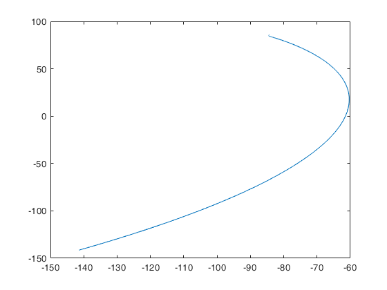
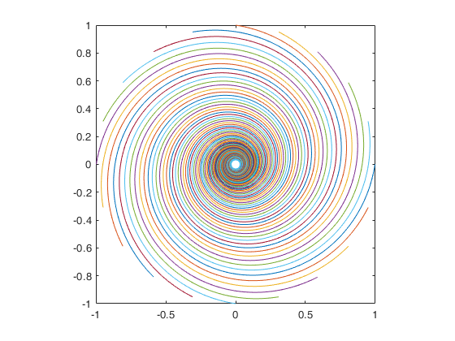

## Contents
* [Chase Model 1 - 1](#chase-model-1---1)
* [Chase Model 1 - 2](#chase-model-1---2)
* [Chase Model 1 - 3](#chase-model-1---3)
* [Chase Model 1 - 4](#chase-model-1---4)
* [Chase Model 2 - 1](#chase-model-2---1)
* [Chase Model 2 - 2](#chase-model-2---2)

## Chase Model 1 - 1
```matlab
%% Chase Model 1 - 1, with precise solution
r = (-5 + sqrt(61)) / 6;
y = @(x) x ./ 2 * (((-200 ./ x)^(- r)) / (- r - 1) + ((-x ./ 200)^(- r)) / (- r + 1)) + 200 * -r / (r^2 - 1);
x = linspace(-200, 0, 1000);
for i = 1:1000
    s(i) = y(x(i));
end
%plot(x, s)

xr = cos(-pi / 4) * x + sin(-pi / 4) * s;
yr = -sin(-pi / 4) * x + cos(-pi / 4) * s;
plot(xr, yr)
```

**Results:**
```
velocity = 17.0803 m / s, distance = 256.2050 m.
```


## Chase Model 1 - 2
```matlab
%% Chase Model 1 - 2, with numerical solution
% for v_d = 17:0.0001:18
%     tspan = [0 15];
%     initial = [-100 * sqrt(2) -100 * sqrt(2)];
%     options = odeset('RelTol',1e-12,'AbsTol',[1e-10 1e-10]);
%     [T, Y] = ode45(@(t, y)odefun(t, y, v_d), tspan, initial, options); % Solve the function
% end

% get distance
v_d = 17.1488;
initial = [-100 * sqrt(2) -100 * sqrt(2)];
options = odeset('RelTol',1e-12,'AbsTol',[1e-10 1e-10]);
[T, Y] = ode45(@(t, y)odefun(t, y, v_d), tspan, initial, options); % Solve the function
dist = 0;
for i = 1: size(Y, 1) - 1
    dist = dist + sqrt((Y(i + 1, 1) - Y(i, 1))^2 + (Y(i + 1, 2) - Y(i, 2))^2);
end
dist
plot(Y(:, 1), Y(:, 2))

function dydt = odefun(t, y, v_d)
    dydt = zeros(2, 1);
    dydx = (y(2) - 4 * sqrt(2) * t) / (y(1) + 4 * sqrt(2) * t);
    dydt(1) = v_d / sqrt(1 + (dydx)^2) * (dydx >= 0) - v_d / sqrt(1 + (dydx)^2) * (dydx < 0);
    dydt(2) = abs(dydx * dydt(1));
    if (norm(y(2) - 4 * sqrt(2) * t, y(1) + 4 * sqrt(2) * t) < eps)
        % distance ok
        error("Successfully chased within 15 seconds. Current velocity: " + v_d);
    end
end
```

**Results:**
```
velocity = 17.1489 m / s, distance = 257.3020 m.
```



## Chase Model 1 - 3
```matlab
%% Chase Model 1 - 3, with simulation
v_d = 17.0952;
epsilon = 1e-6;
step = 1e-3;
max_time = 15;
xd = zeros(1, ceil(max_time / step) + 1);
yd = zeros(1, ceil(max_time / step) + 1);
xd(1) = -100 * sqrt(2);
yd(1) = -100 * sqrt(2);
for i = 1: ceil(max_time / step)
    time = (i - 1) * step;
    xr = -4 * sqrt(2) * time;
    yr = 4 * sqrt(2) * time;
    distance = sqrt((xd(i) - xr)^2 + (yd(i) - yr)^2);
    if (distance < epsilon)
        break;
    end
    xdir = xr - xd(i);
    ydir = yr - yd(i);
    xd(i + 1) = xd(i) + v_d * step * xdir / distance;
    yd(i + 1) = yd(i) + v_d * step * ydir / distance;
end
dist = 0;
for i = 1: 15000
    dist = dist + sqrt((xd(i + 1) - xd(i))^2 + (yd(i + 1) - yd(i))^2);
end
dist
plot(xd(1: i), yd(1: i))
```

**Results:**
```
velocity = 17.0952 m / s, distance = 256.4280 m.
```


## Chase Model 1 - 4
```matlab
%% Chase Model 1 - 4, with simulation
v_d = 15.4415;
epsilon = 1e-6;
step = 1e-4;
max_time = 20;
xr = zeros(1, ceil(max_time / step) + 1);
yr = zeros(1, ceil(max_time / step) + 1);
xd = zeros(1, ceil(max_time / step) + 1);
yd = zeros(1, ceil(max_time / step) + 1);
xd(1) = -100 * sqrt(2);
yd(1) = -100 * sqrt(2);
xr(1) = 0;
yr(1) = 0;
distance = inf;
key = inf;

r_dist = 0;
d_dist = 0;

for i = 1: ceil(max_time / step)
    if (distance < 30)
        key = min(key, i);
    end
    time = (i - 1) * step;
    if ~isinf(key)
        v_rt = @(t) 8 * (0.5)^(t - (key - 1) * step);
        v_dt = @(t) v_d * (1.1)^(t - (key - 1) * step);
    else
        v_rt = @(t)8;
        v_dt = @(t) v_d;
    end
    xr(i + 1) = xr(i) - v_rt(time) * cos(pi / 4) * step;
    yr(i + 1) = yr(i) + v_rt(time) * sin(pi / 4) * step;
    distance = sqrt((xd(i) - xr(i))^2 + (yd(i) - yr(i))^2);
    if (distance < epsilon)
        break;
    end
    xdir = xr(i) - xd(i);
    ydir = yr(i) - yd(i);
    xd(i + 1) = xd(i) + v_dt(time) * step * xdir / distance;
    yd(i + 1) = yd(i) + v_dt(time) * step * ydir / distance;
    d_dist = d_dist + sqrt((xd(i + 1) - xd(i))^2 + (yd(i + 1) - yd(i))^2);
    r_dist = r_dist + sqrt((xr(i + 1) - xr(i))^2 + (yr(i + 1) - yr(i))^2);
end

if (i < ceil(max_time / step)) && (r_dist <= 120)
    v_d
    time
    d_dist
end

plot(xd(1: i), yd(1: i))
```

**Results:**
```
velocity = 15.4415 m / s, distance = 252.1541 m.
```


## Chase Model 2 - 1
```matlab
%% Chase Model 2 - 1, with simulation
n = 20;
r = 1;
v = ones(1, n);
step = 1e-2;
max_time = 200;
x = zeros(n, ceil(max_time / step) + 1);
y = zeros(n, ceil(max_time / step) + 1);
for j = 1: n
    x(j, 1) = r * cos(- 2 * pi / n * (j - 1));
    y(j, 1) = r * sin(- 2 * pi / n * (j - 1));
end
per_dist = zeros(n, 1);

for i = 1: ceil(max_time / step)
    for j = 1: n
        distance = sqrt((x(mod(j, n) + 1, i) - x(j, i))^2 + ...
                        (y(mod(j, n) + 1, i) - y(j, i))^2);
        xdir = x(mod(j, n) + 1, i) - x(j, i);
        ydir = y(mod(j, n) + 1, i) - y(j, i);
        x(j, i + 1) = x(j, i) + v(j) * step * xdir / distance;
        y(j, i + 1) = y(j, i) + v(j) * step * ydir / distance;
        per_dist(j) = per_dist(j) + sqrt((x(j, i + 1) - x(j, i))^2 + (y(j, i + 1) - y(j, i))^2);
    end
end

for j = 1: n
    plot(x(j, :), y(j, :));
    hold on;
    axis square;
end
```

**Results:**



## Chase Model 2 - 2
```matlab
%% Chase Model 2 - 2, with precise solution
n = 20;
theta = linspace(0, -100 * pi, 100000);
for i = 1: n
    r = 1 * exp((1 - cos(2 * pi / n)) / (sin(2 * pi / n)) * theta);
    polar(theta - 2 * pi / n * (i - 1), r);
    hold on;
    axis square;
end
```

**Results:**


