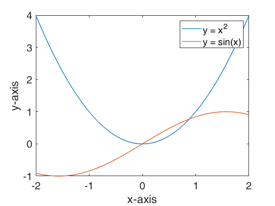
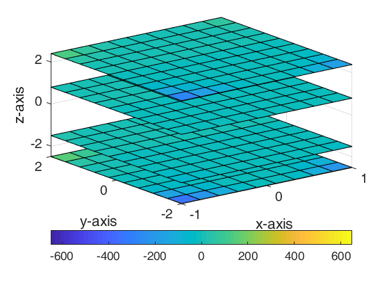
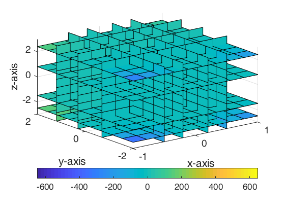

## Contents
* [Exercise 1](#exercise-1)
* [Exercise 2](#exercise-2)
* [Exercise 3](#exercise-3)
* [Exercise 4](#exercise-4)
* [Exercise 5](#exercise-5)
* [Exercise 6](#exercise-6)
* [Exercise 7](#exercise-7)
* [Exercise 8](#exercise-8)
* [Exercise 9](#exercise-9)

## Exercise 1
```matlab
%% Exercise 1
clear, clc;
x = linspace(-2, 2, 1000);
y1 = x.^2;
y2 = sin(x);
plot(x, y1, x, y2, 'linewidth', 1);
legend('y = x^2', 'y = sin(x)');
xlabel('x-axis');
ylabel('y-axis');
set(gca, 'fontsize', 16);
```

**Results:**



## Exercise 2
```matlab
%% Exercise 2
% method 1
clear, clc;
interval = 1000;
func1 = @(x) sin(x);
func = @(t) (1 - t .^ 2) .^ (3 / 2);
x = linspace(0, 4 * pi, 100);
for i = 1:100
    t = linspace(0, func1(x(i)), interval + 1);
    y(i) = sum(func(t) * func1(x(i)) / interval);
end
figure(2);
plot(x, y, 'linewidth', 1);
xlabel('x-axis');
ylabel('y-axis');
xlim([0 4 * pi]);
set(gca, 'fontsize', 16);

% method 2
clear, clc;
syms x t;
y = (1 - t ^ 2) ^ (3 / 2);
z = int(y, t, 0, sin(x));
figure(1);
fplot(z, [0 4 * pi], 'linewidth', 1);
xlabel('x-axis');
ylabel('y-axis');
set(gca, 'fontsize', 16);
```

**Results:**


## Exercise 3
```matlab
%% Exercise 3
clear; clc;
x=-4: 0.2: 4; 
y=-4: 0.2: 4;

figure(1); %表面图
[xx, yy] = meshgrid(x, y);
zz = sin(xx .* yy) .* xx .^ 2 .* yy .^ 3;
mesh(xx, yy, zz);
title('Surface Plot');
xlabel('x-axis');
ylabel('y-axis');
zlabel('z-axis');
set(gca, 'fontsize', 16);

figure(2); %轮廓图
contour(xx, yy, zz, 10);
title('Contour Plot')
xlabel('x-axis');
ylabel('y-axis');
set(gca, 'fontsize', 16);

figure(3);  %伪彩图
pcolor(xx, yy, zz);
title('Pesudo Color Plot')
colorbar('vert');
xlabel('x-axis');
ylabel('y-axis');
set(gca, 'fontsize', 16);

figure(4); %着色表面图
surfl(xx, yy, zz);
title('Surface Plot');
xlabel('x-axis');
ylabel('y-axis');
zlabel('z-axis');
set(gca, 'fontsize', 16);
```

**Results:**


## Exercise 4
```matlab
%% Exercise 4
clear, clc;
x = linspace(-1, 1, 10);
y = linspace(-2, 2, 10);
z = linspace(-3, 3, 10);
[xx, yy, zz] = meshgrid(x, y, z);
v = (xx.^2) .* (yy.^3) .* (zz.^4);
xi = [-0.5, -0.2, 0.2, 0.5];
yi = [-0.7 0.3 1.2];
zi = [-2.5, -1.5, 0.8, 2.4];

figure(1); % projection on X-axis
slice(xx, yy, zz, v, xi, [], []);
colorbar('horiz');
xlabel('x-axis');
ylabel('y-axis');
zlabel('z-axis');
set(gca, 'fontsize', 14);

figure(2); % projection on Y-axis
slice(xx, yy, zz, v, [], yi, []);
colorbar('horiz');
xlabel('x-axis');
ylabel('y-axis');
zlabel('z-axis');
set(gca, 'fontsize', 14);

figure(3); % projection on Z-axis
slice(xx, yy, zz, v, [], [], zi);
colorbar('horiz');
xlabel('x-axis');
ylabel('y-axis');
zlabel('z-axis');
set(gca, 'fontsize', 14);

figure(4); % full projection
slice(xx, yy, zz, v, xi, yi, zi);
colorbar('horiz');
xlabel('x-axis');
ylabel('y-axis');
zlabel('z-axis');
set(gca, 'fontsize', 14);

figure(5); % slice on z = x^2 - y^2
[xsurf, ysurf] = meshgrid(-1: 0.1: 1, -1: 0.1: 1);
zsurf = xsurf .^ 2 - ysurf .^ 2;
slice(xx, yy, zz, v, xsurf, ysurf, zsurf);
colorbar('horiz');
xlabel('x-axis');
ylabel('y-axis');
zlabel('z-axis');
set(gca, 'fontsize', 14);
```

**Results:**







## Exercise 5
```matlab
%% Exercise 5
clear, clc;
x = linspace(-2 * pi, 2 * pi, 50);
y = linspace(-2 * pi, 2 * pi, 50);
t = linspace(0, 10, 1000);
[xx, yy] = meshgrid(x, y);
for i = 1: size(t, 2)
    zz = 10 .* exp(1 - t(i)).* sin(xx) .* cos(yy);
    surf(xx, yy, zz);
    axis([-2 * pi, 2 * pi, -2 * pi, 2 * pi, -30, 30]);
    xlabel('x-axis');
    ylabel('y-axis');
    title("plot where t = " + num2str(t(i)));
    set(gca, 'fontsize', 14);
    drawnow;
end
```

**Results:**


## Exercise 6
```matlab
%% Exercise 6
[x, y] = meshgrid(-2: .25 :2, -2: .25: 2);
Dy = sin(x .* y);
contour(x, y, Dy);
hold on;
quiver(x, y, ones(size(Dy)), Dy);
[xreal, yreal] = ode45(@(x, y) sin(x .* y), [-2, 2.2], -1.2);
plot(xreal, yreal, 'black', 'linewidth', 2);
[xreal, yreal] = ode45(@(x, y) sin(x .* y), [-2, 2.2], 0);
plot(xreal, yreal, 'red', 'linewidth', 2);
[xreal, yreal] = ode45(@(x, y) sin(x .* y), [-2, 2.2], 1.8);
plot(xreal, yreal, 'magenta', 'linewidth', 2);
legend('contour', 'arrows', 'initial=-1.2', 'initial=0', 'initial=1.8', 'Location','NorthEastOutside')
hold off;
axis square;
xlabel('x-axis');
ylabel('y-axis');
set(gca, 'fontsize', 14);
```

**Results:**


## Exercise 7
```matlab
%% Exercise 7
clear, clc;
x0 = 1; 
y0 = 1;
m = [0.5 0 0 0.5   0    0;
     0.5 0 0 0.5 0.5    0;
     0.5 0 0 0.5 0.25 0.5];
p = [0.3333 0.3333 0.3334];
plot(x0, y0, '.');
hold on;
for i = 1:1000
    prob = m(randi(3), :);
    plot(x0, y0, '.');
    hold on;
    xlabel('x-axis');
    ylabel('y-axis');
    title("Iteration " + num2str(i));
    set(gca, 'fontsize', 14);
    drawnow;
    x=dot([x0 y0], prob(1: 2)) + prob(5);
    y=dot([x0 y0], prob(3: 4)) + prob(6);
    x0 = x;
    y0 = y;    
end
hold off;
```

**Results:**


## Exercise 8
```matlab
%% Exercise 8
clear, clc;
fimplicit(@(x, y) sin(x .* y) + x + y, [-5 5 -5 5], 'linewidth', 1);
xlabel('x-axis');
ylabel('y-axis');
set(gca, 'fontsize', 16);
```

**Results:**


## Exercise 9
```matlab
%% Exercise 9
clear, clc;
load('data.mat')
xx(isnan(xx(1, :)), :)=[]; % remove x-axis nan
xx(isnan(xx(2, :)), :)=[]; % remove y-axis nan
x=xx(:, 1);
y=xx(:, 2);
scatter(x, y, 20);
xlabel('x-axis');
ylabel('y-axis');
set(gca, 'fontsize', 16);
```

**Results:**

