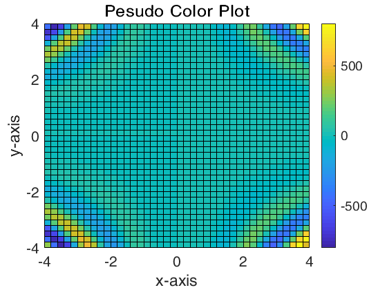

<head>
      <meta http-equiv="Content-Type" content="text/html; charset=utf-8">
   <!--
This HTML was auto-generated from MATLAB code.
To make changes, update the MATLAB code and republish this document.
      --><meta name="generator" content="MATLAB 9.4"><link rel="schema.DC" href="http://purl.org/dc/elements/1.1/"><meta name="DC.date" content="2019-03-13"><meta name="DC.source" content="experiment1.m"></head><body>
<h2>Contents</h2>
<ul><li><a href="#1">Exercise 1</a></li><li><a href="#2">Exercise 2</a></li><li><a href="#3">Exercise 3</a></li><li><a href="#4">Exercise 4</a></li><li><a href="#5">Exercise 5</a></li><li><a href="#6">Exercise 6</a></li><li><a href="#7">Exercise 7</a></li><li><a href="#8">Exercise 8</a></li><li><a href="#9">Exercise 9</a></li></ul>
<h2 id="1">Exercise 1</h2><pre class="codeinput">clear, clc;
x = linspace(-2, 2, 1000);
y1 = x.^2;
y2 = sin(x);
plot(x, y1, x, y2, 'linewidth', 1);
legend('y = x^2', 'y = sin(x)');
xlabel('x-axis');
ylabel('y-axis');
set(gca, 'fontsize', 16);
</pre> <h2 id="2">Exercise 2</h2><pre class="codeinput">clear, clc;
syms x t;
y=(1 - t ^ 2) ^ (3 / 2);
z=int(y, t, 0, sin(x));
fplot(z, [0 4 * pi], 'linewidth', 1);
xlabel('x-axis');
ylabel('y-axis');
set(gca, 'fontsize', 16);
</pre> <h2 id="3">Exercise 3</h2><pre class="codeinput">clear; clc;
x=-4: 0.2: 4;
y=-4: 0.2: 4;

figure(1); %&#34920;&#38754;&#22270;
[xx, yy] = meshgrid(x, y);
zz = sin(xx .* yy) .* xx .^ 2 .* yy .^ 3;
mesh(xx, yy, zz);
hold on;
zz0 = zeros(size(xx));
plot3(xx, yy, zz0, 'bo');
title('Surface Plot');
xlabel('x-axis');
ylabel('y-axis');
zlabel('z-axis');
set(gca, 'fontsize', 16);

figure(2); %&#36718;&#24275;&#22270;
contour(xx, yy, zz, 10);
hold on;
title('Contour Plot')
xlabel('x-axis');
ylabel('y-axis');
set(gca, 'fontsize', 16);

figure(3);  %&#20266;&#24425;&#22270;
pcolor(xx, yy, zz);
hold on;
title('Pesudo Color Plot')
colormap(cool);
colorbar('vert');
xlabel('x-axis');
ylabel('y-axis');
set(gca, 'fontsize', 16);

figure(4);%&#30528;&#33394;&#34920;&#38754;&#22270;
surfl(xx, yy, zz);
title('Surface Plot');
xlabel('x-axis');
ylabel('y-axis');
zlabel('z-axis');
set(gca, 'fontsize', 16);
</pre>    <h2 id="4">Exercise 4</h2><pre class="codeinput">clear, clc;
x = linspace(-1, 1, 10);
y = linspace(-2, 2, 10);
z = linspace(-3, 3, 10);
[xx, yy, zz] = meshgrid(x, y, z);
v = (xx.^2) .* (yy.^3) .* (zz.^4);
xi = [-0.5, -0.2, 0.2, 0.5];
yi = [-0.7 0.3 1.2];
zi = [-2.5, -1.5, 0.8, 2.4];

figure(1); % projection on X-axis
slice(xx, yy, zz, v, xi, [], []);
colorbar('horiz');
xlabel('x-axis');
ylabel('y-axis');
zlabel('z-axis');
set(gca, 'fontsize', 14);

figure(2); % projection on Y-axis
slice(xx, yy, zz, v, [], yi, []);
colorbar('horiz');
xlabel('x-axis');
ylabel('y-axis');
zlabel('z-axis');
set(gca, 'fontsize', 14);

figure(3); % projection on Z-axis
slice(xx, yy, zz, v, [], [], zi);
colorbar('horiz');
xlabel('x-axis');
ylabel('y-axis');
zlabel('z-axis');
set(gca, 'fontsize', 14);

figure(4); % full projection
slice(xx, yy, zz, v, xi, yi, zi);
colorbar('horiz');
xlabel('x-axis');
ylabel('y-axis');
zlabel('z-axis');
set(gca, 'fontsize', 14);

figure(5); % slice on z = x^2 - y^2
[xsurf, ysurf] = meshgrid(-1: 0.1: 1, -1: 0.1: 1);
zsurf = xsurf .^ 2 - ysurf .^ 2;
slice(xx, yy, zz, v, xsurf, ysurf, zsurf);
colorbar('horiz');
xlabel('x-axis');
ylabel('y-axis');
zlabel('z-axis');
set(gca, 'fontsize', 14);
</pre>     <h2 id="5">Exercise 5</h2><pre class="codeinput">clear, clc;
x = linspace(-2 * pi, 2 * pi, 50);
y = linspace(-2 * pi, 2 * pi, 50);
t = linspace(0, 10, 1000);
[xx, yy] = meshgrid(x, y);
for i = 1: size(t, 2)
    zz = 10 .* exp(1 - t(i)).* sin(xx) .* cos(yy);
    surf(xx, yy, zz);
    axis([-2 * pi, 2 * pi, -2 * pi, 2 * pi, -30, 30]);
    xlabel('x-axis');
    ylabel('y-axis');
    title("plot where t = " + num2str(t(i)));
    set(gca, 'fontsize', 14);
    drawnow;
end
</pre> <h2 id="6">Exercise 6</h2><pre class="codeinput">[x, y] = meshgrid(-2: .2 :2, -2: .2: 2);
Dy = sin(x .* y);
[fx, fy] = gradient(Dy, .2, .2);
contour(x, y, Dy);
hold on;
quiver(x, y, fx, fy);
hold off;
axis image;
xlabel('x-axis');
ylabel('y-axis');
set(gca, 'fontsize', 14);
</pre> <h2 id="7">Exercise 7</h2><pre class="codeinput">clear, clc;
x0 = 1;
y0 = 1;
m = [0.5 0 0 0.5   0    0;
     0.5 0 0 0.5 0.5    0;
     0.5 0 0 0.5 0.25 0.5];
p = [0.3333 0.3333 0.3334];
plot(x0, y0, '.');
hold on;
for i = 1:1000
    prob = m(randi(3), :);
    plot(x0, y0, '.');
    hold on;
    xlabel('x-axis');
    ylabel('y-axis');
    title("Iteration " + num2str(i));
    set(gca, 'fontsize', 14);
    drawnow;
    x=dot([x0 y0], prob(1: 2)) + prob(5);
    y=dot([x0 y0], prob(3: 4)) + prob(6);
    x0 = x;
    y0 = y;
end
hold off;
</pre> <h2 id="8">Exercise 8</h2><pre class="codeinput">clear, clc;
fimplicit(@(x, y) sin(x .* y) + x + y, [-5 5 -5 5], 'linewidth', 1);
xlabel('x-axis');
ylabel('y-axis');
set(gca, 'fontsize', 16);
</pre> <h2 id="9">Exercise 9</h2><pre class="codeinput">clear, clc;
load('data.mat')
xx(isnan(xx(1, :)), :)=[]; % remove x-axis nan
xx(isnan(xx(2, :)), :)=[]; % remove y-axis nan
x=xx(:, 1);
y=xx(:, 2);
scatter(x, y, 20);
xlabel('x-axis');
ylabel('y-axis');
set(gca, 'fontsize', 16);
</pre> 
 <a href="https://www.mathworks.com/products/matlab/">Published with MATLAB&reg; R2018a</a> 

<!--
##### SOURCE BEGIN #####
%% Exercise 1
clear, clc;
x = linspace(-2, 2, 1000);
y1 = x.^2;
y2 = sin(x);
plot(x, y1, x, y2, 'linewidth', 1);
legend('y = x^2', 'y = sin(x)');
xlabel('x-axis');
ylabel('y-axis');
set(gca, 'fontsize', 16);

%% Exercise 2
clear, clc;
syms x t;
y=(1 - t ^ 2) ^ (3 / 2);
z=int(y, t, 0, sin(x));
fplot(z, [0 4 * pi], 'linewidth', 1);
xlabel('x-axis');
ylabel('y-axis');
set(gca, 'fontsize', 16);

%% Exercise 3
clear; clc;
x=-4: 0.2: 4; 
y=-4: 0.2: 4;

figure(1); %表面图
[xx, yy] = meshgrid(x, y);
zz = sin(xx .* yy) .* xx .^ 2 .* yy .^ 3;
mesh(xx, yy, zz);
hold on;
zz0 = zeros(size(xx));
plot3(xx, yy, zz0, 'bo');
title('Surface Plot');
xlabel('x-axis');
ylabel('y-axis');
zlabel('z-axis');
set(gca, 'fontsize', 16);

figure(2); %轮廓图
contour(xx, yy, zz, 10);
hold on;
title('Contour Plot')
xlabel('x-axis');
ylabel('y-axis');
set(gca, 'fontsize', 16);

figure(3);  %伪彩图
pcolor(xx, yy, zz);
hold on;
title('Pesudo Color Plot')
colormap(cool);
colorbar('vert');
xlabel('x-axis');
ylabel('y-axis');
set(gca, 'fontsize', 16);

figure(4);%着色表面图
surfl(xx, yy, zz);
title('Surface Plot');
xlabel('x-axis');
ylabel('y-axis');
zlabel('z-axis');
set(gca, 'fontsize', 16);

%% Exercise 4
clear, clc;
x = linspace(-1, 1, 10);
y = linspace(-2, 2, 10);
z = linspace(-3, 3, 10);
[xx, yy, zz] = meshgrid(x, y, z);
v = (xx.^2) .* (yy.^3) .* (zz.^4);
xi = [-0.5, -0.2, 0.2, 0.5];
yi = [-0.7 0.3 1.2];
zi = [-2.5, -1.5, 0.8, 2.4];

figure(1); % projection on X-axis
slice(xx, yy, zz, v, xi, [], []);
colorbar('horiz');
xlabel('x-axis');
ylabel('y-axis');
zlabel('z-axis');
set(gca, 'fontsize', 14);

figure(2); % projection on Y-axis
slice(xx, yy, zz, v, [], yi, []);
colorbar('horiz');
xlabel('x-axis');
ylabel('y-axis');
zlabel('z-axis');
set(gca, 'fontsize', 14);

figure(3); % projection on Z-axis
slice(xx, yy, zz, v, [], [], zi);
colorbar('horiz');
xlabel('x-axis');
ylabel('y-axis');
zlabel('z-axis');
set(gca, 'fontsize', 14);

figure(4); % full projection
slice(xx, yy, zz, v, xi, yi, zi);
colorbar('horiz');
xlabel('x-axis');
ylabel('y-axis');
zlabel('z-axis');
set(gca, 'fontsize', 14);

figure(5); % slice on z = x^2 - y^2
[xsurf, ysurf] = meshgrid(-1: 0.1: 1, -1: 0.1: 1);
zsurf = xsurf .^ 2 - ysurf .^ 2;
slice(xx, yy, zz, v, xsurf, ysurf, zsurf);
colorbar('horiz');
xlabel('x-axis');
ylabel('y-axis');
zlabel('z-axis');
set(gca, 'fontsize', 14);

%% Exercise 5
clear, clc;
x = linspace(-2 * pi, 2 * pi, 50);
y = linspace(-2 * pi, 2 * pi, 50);
t = linspace(0, 10, 1000);
[xx, yy] = meshgrid(x, y);
for i = 1: size(t, 2)
    zz = 10 .* exp(1 - t(i)).* sin(xx) .* cos(yy);
    surf(xx, yy, zz);
    axis([-2 * pi, 2 * pi, -2 * pi, 2 * pi, -30, 30]);
    xlabel('x-axis');
    ylabel('y-axis');
    title("plot where t = " + num2str(t(i)));
    set(gca, 'fontsize', 14);
    drawnow;
end

%% Exercise 6
[x, y] = meshgrid(-2: .2 :2, -2: .2: 2);
Dy = sin(x .* y);
[fx, fy] = gradient(Dy, .2, .2);
contour(x, y, Dy);
hold on;
quiver(x, y, fx, fy);
hold off;
axis image;
xlabel('x-axis');
ylabel('y-axis');
set(gca, 'fontsize', 14);

%% Exercise 7
clear, clc;
x0 = 1; 
y0 = 1;
m = [0.5 0 0 0.5   0    0;
     0.5 0 0 0.5 0.5    0;
     0.5 0 0 0.5 0.25 0.5];
p = [0.3333 0.3333 0.3334];
plot(x0, y0, '.');
hold on;
for i = 1:1000
    prob = m(randi(3), :);
    plot(x0, y0, '.');
    hold on;
    xlabel('x-axis');
    ylabel('y-axis');
    title("Iteration " + num2str(i));
    set(gca, 'fontsize', 14);
    drawnow;
    x=dot([x0 y0], prob(1: 2)) + prob(5);
    y=dot([x0 y0], prob(3: 4)) + prob(6);
    x0 = x;
    y0 = y;    
end
hold off;

%% Exercise 8
clear, clc;
fimplicit(@(x, y) sin(x .* y) + x + y, [-5 5 -5 5], 'linewidth', 1);
xlabel('x-axis');
ylabel('y-axis');
set(gca, 'fontsize', 16);

%% Exercise 9
clear, clc;
load('data.mat')
xx(isnan(xx(1, :)), :)=[]; % remove x-axis nan
xx(isnan(xx(2, :)), :)=[]; % remove y-axis nan
x=xx(:, 1);
y=xx(:, 2);
scatter(x, y, 20);
xlabel('x-axis');
ylabel('y-axis');
set(gca, 'fontsize', 16);
##### SOURCE END #####
--></body>