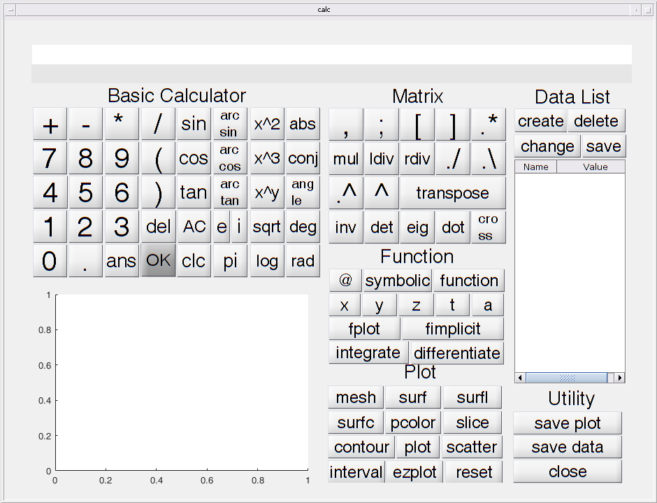

## Contents
* [Source codes of the project](#source-code)
* [Compiled binary](#binary)

## Source Code
If you don't want to see the source codes here, you can jump to the bottom to access the [binary files](#binary).

```matlab
function varargout = calc(varargin)
% CALC MATLAB code for calc.fig
%      CALC, by itself, creates a new CALC or raises the existing
%      singleton*.
%
%      H = CALC returns the handle to a new CALC or the handle to
%      the existing singleton*.
%
%      CALC('CALLBACK',hObject,eventData,handles,...) calls the local
%      function named CALLBACK in CALC.M with the given input arguments.
%
%      CALC('Property','Value',...) creates a new CALC or raises the
%      existing singleton*.  Starting from the left, property value pairs are
%      applied to the GUI before calc_OpeningFcn gets called.  An
%      unrecognized property name or invalid value makes property application
%      stop.  All inputs are passed to calc_OpeningFcn via varargin.
%
%      *See GUI Options on GUIDE's Tools menu.  Choose "GUI allows only one
%      instance to run (singleton)".
%
% See also: GUIDE, GUIDATA, GUIHANDLES

% Edit the above text to modify the response to help calc

% Last Modified by GUIDE v2.5 28-Mar-2019 20:28:37

% Begin initialization code - DO NOT EDIT
gui_Singleton = 1;
gui_State = struct('gui_Name',       mfilename, ...
                   'gui_Singleton',  gui_Singleton, ...
                   'gui_OpeningFcn', @calc_OpeningFcn, ...
                   'gui_OutputFcn',  @calc_OutputFcn, ...
                   'gui_LayoutFcn',  [] , ...
                   'gui_Callback',   []);
if nargin && ischar(varargin{1})
    gui_State.gui_Callback = str2func(varargin{1});
end

if nargout
    [varargout{1:nargout}] = gui_mainfcn(gui_State, varargin{:});
else
    gui_mainfcn(gui_State, varargin{:});
end
% End initialization code - DO NOT EDIT


% --- Executes just before calc is made visible.
function calc_OpeningFcn(hObject, eventdata, handles, varargin)
% This function has no output args, see OutputFcn.
% hObject    handle to figure
% eventdata  reserved - to be defined in a future version of MATLAB
% handles    structure with handles and user data (see GUIDATA)
% varargin   command line arguments to calc (see VARARGIN)

% set welcome page
version = '0.8.6';
msg = msgbox({strcat('MatLab(R) calculator, ', version), 'Designed by:', ...
                     'Song Zhaoyan', ...
                     'Xu Yi', ...
                     'Li Zonglin', ...
                     'Xiang Feiyu', ...
                     'All rights reserved, 2019-.', ...
                     'Please make sure your computer''s resolution is GREATER THAN 1024x768,'...
                     'or this program will misbehave.'}, 'Welcome', 'modal');
% Choose default command line output for calc
handles.output = hObject;

% set global command
handles.command = '';
handles.commandlist = {};
handles.commandcounts = 0;
handles.answer = 0;
handles.globalexp = exp(1);
set(handles.datalist, 'Data', cell(0, 2));
cla(handles.mainplot, 'reset');

% set global data
handles.data = containers.Map;

% Update handles structure
guidata(hObject, handles);

% UIWAIT makes calc wait for user response (see UIRESUME)
uiwait(msg);


% --- Outputs from this function are returned to the commandwindow line.
function varargout = calc_OutputFcn(hObject, eventdata, handles) 
% varargout  cell array for returning output args (see VARARGOUT);
% hObject    handle to figure
% eventdata  reserved - to be defined in a future version of MATLAB
% handles    structure with handles and user data (see GUIDATA)

% Get default command line output from handles structure
varargout{1} = handles.output;

% --- Executes on button press in nbutton0.
function nbutton0_Callback(hObject, eventdata, handles)
% hObject    handle to nbutton0 (see GCBO)
% eventdata  reserved - to be defined in a future version of MATLAB
% handles    structure with handles and user data (see GUIDATA)
handles.command = strcat(handles.command, '0');
set(handles.commandwindow, 'string', handles.command);
handles.commandcounts = handles.commandcounts + 1;
handles.commandlist{handles.commandcounts} = handles.command;
guidata(hObject, handles);

% --- Executes on button press in nbutton1.
function nbutton1_Callback(hObject, eventdata, handles)
% hObject    handle to nbutton1 (see GCBO)
% eventdata  reserved - to be defined in a future version of MATLAB
% handles    structure with handles and user data (see GUIDATA)
handles.command = strcat(handles.command, '1');
set(handles.commandwindow, 'string', handles.command);
handles.commandcounts = handles.commandcounts + 1;
handles.commandlist{handles.commandcounts} = handles.command;
guidata(hObject, handles);

% --- Executes on button press in nbutton2.
function nbutton2_Callback(hObject, eventdata, handles)
% hObject    handle to nbutton2 (see GCBO)
% eventdata  reserved - to be defined in a future version of MATLAB
% handles    structure with handles and user data (see GUIDATA)
handles.command = strcat(handles.command, '2');
set(handles.commandwindow, 'string', handles.command);
handles.commandcounts = handles.commandcounts + 1;
handles.commandlist{handles.commandcounts} = handles.command;
guidata(hObject, handles);

% --- Executes on button press in nbutton3.
function nbutton3_Callback(hObject, eventdata, handles)
% hObject    handle to nbutton3 (see GCBO)
% eventdata  reserved - to be defined in a future version of MATLAB
% handles    structure with handles and user data (see GUIDATA)
handles.command = strcat(handles.command, '3');
set(handles.commandwindow, 'string', handles.command);
handles.commandcounts = handles.commandcounts + 1;
handles.commandlist{handles.commandcounts} = handles.command;
guidata(hObject, handles);

% --- Executes on button press in nbutton4.
function nbutton4_Callback(hObject, eventdata, handles)
% hObject    handle to nbutton4 (see GCBO)
% eventdata  reserved - to be defined in a future version of MATLAB
% handles    structure with handles and user data (see GUIDATA)
handles.command = strcat(handles.command, '4');
set(handles.commandwindow, 'string', handles.command);
handles.commandcounts = handles.commandcounts + 1;
handles.commandlist{handles.commandcounts} = handles.command;
guidata(hObject, handles);

% --- Executes on button press in nbutton5.
function nbutton5_Callback(hObject, eventdata, handles)
% hObject    handle to nbutton5 (see GCBO)
% eventdata  reserved - to be defined in a future version of MATLAB
% handles    structure with handles and user data (see GUIDATA)
handles.command = strcat(handles.command, '5');
set(handles.commandwindow, 'string', handles.command);
handles.commandcounts = handles.commandcounts + 1;
handles.commandlist{handles.commandcounts} = handles.command;
guidata(hObject, handles);

% --- Executes on button press in nbutton6.
function nbutton6_Callback(hObject, eventdata, handles)
% hObject    handle to nbutton6 (see GCBO)
% eventdata  reserved - to be defined in a future version of MATLAB
% handles    structure with handles and user data (see GUIDATA)
handles.command = strcat(handles.command, '6');
set(handles.commandwindow, 'string', handles.command);
handles.commandcounts = handles.commandcounts + 1;
handles.commandlist{handles.commandcounts} = handles.command;
guidata(hObject, handles);

% --- Executes on button press in nbutton7.
function nbutton7_Callback(hObject, eventdata, handles)
% hObject    handle to nbutton7 (see GCBO)
% eventdata  reserved - to be defined in a future version of MATLAB
% handles    structure with handles and user data (see GUIDATA)
handles.command = strcat(handles.command, '7');
set(handles.commandwindow, 'string', handles.command);
handles.commandcounts = handles.commandcounts + 1;
handles.commandlist{handles.commandcounts} = handles.command;
guidata(hObject, handles);

% --- Executes on button press in nbutton8.
function nbutton8_Callback(hObject, eventdata, handles)
% hObject    handle to nbutton8 (see GCBO)
% eventdata  reserved - to be defined in a future version of MATLAB
% handles    structure with handles and user data (see GUIDATA)
handles.command = strcat(handles.command, '8');
set(handles.commandwindow, 'string', handles.command);
handles.commandcounts = handles.commandcounts + 1;
handles.commandlist{handles.commandcounts} = handles.command;
guidata(hObject, handles);

% --- Executes on button press in nbutton9.
function nbutton9_Callback(hObject, eventdata, handles)
% hObject    handle to nbutton9 (see GCBO)
% eventdata  reserved - to be defined in a future version of MATLAB
% handles    structure with handles and user data (see GUIDATA)
handles.command = strcat(handles.command, '9');
set(handles.commandwindow, 'string', handles.command);
handles.commandcounts = handles.commandcounts + 1;
handles.commandlist{handles.commandcounts} = handles.command;
guidata(hObject, handles);

% --- Executes on button press in nbuttoni.
function nbuttoni_Callback(hObject, eventdata, handles)
% hObject    handle to nbuttoni (see GCBO)
% eventdata  reserved - to be defined in a future version of MATLAB
% handles    structure with handles and user data (see GUIDATA)
handles.command = strcat(handles.command, 'i');
set(handles.commandwindow, 'string', handles.command);
handles.commandcounts = handles.commandcounts + 1;
handles.commandlist{handles.commandcounts} = handles.command;
guidata(hObject, handles);

% --- Executes on button press in pointbutton.
function pointbutton_Callback(hObject, eventdata, handles)
% hObject    handle to pointbutton (see GCBO)
% eventdata  reserved - to be defined in a future version of MATLAB
% handles    structure with handles and user data (see GUIDATA)
handles.command = strcat(handles.command, '.');
set(handles.commandwindow, 'string', handles.command);
handles.commandcounts = handles.commandcounts + 1;
handles.commandlist{handles.commandcounts} = handles.command;
guidata(hObject, handles);

% --- Executes on button press in leftbracket.
function leftbracket_Callback(hObject, eventdata, handles)
% hObject    handle to leftbracket (see GCBO)
% eventdata  reserved - to be defined in a future version of MATLAB
% handles    structure with handles and user data (see GUIDATA)
handles.command = strcat(handles.command, '(');
set(handles.commandwindow, 'string', handles.command);
handles.commandcounts = handles.commandcounts + 1;
handles.commandlist{handles.commandcounts} = handles.command;
guidata(hObject, handles);

% --- Executes on button press in rightbracket.
function rightbracket_Callback(hObject, eventdata, handles)
% hObject    handle to rightbracket (see GCBO)
% eventdata  reserved - to be defined in a future version of MATLAB
% handles    structure with handles and user data (see GUIDATA)
handles.command = strcat(handles.command, ')');
set(handles.commandwindow, 'string', handles.command);
handles.commandcounts = handles.commandcounts + 1;
handles.commandlist{handles.commandcounts} = handles.command;
guidata(hObject, handles);

% --- Executes on button press in addbutton.
function addbutton_Callback(hObject, eventdata, handles)
% hObject    handle to addbutton (see GCBO)
% eventdata  reserved - to be defined in a future version of MATLAB
% handles    structure with handles and user data (see GUIDATA)
handles.command = strcat(handles.command, '+');
set(handles.commandwindow, 'string', handles.command);
handles.commandcounts = handles.commandcounts + 1;
handles.commandlist{handles.commandcounts} = handles.command;
guidata(hObject, handles);

% --- Executes on button press in minusbutton.
function minusbutton_Callback(hObject, eventdata, handles)
% hObject    handle to minusbutton (see GCBO)
% eventdata  reserved - to be defined in a future version of MATLAB
% handles    structure with handles and user data (see GUIDATA)
handles.command = strcat(handles.command, '-');
set(handles.commandwindow, 'string', handles.command);
handles.commandcounts = handles.commandcounts + 1;
handles.commandlist{handles.commandcounts} = handles.command;
guidata(hObject, handles);

% --- Executes on button press in timesbutton.
function timesbutton_Callback(hObject, eventdata, handles)
% hObject    handle to timesbutton (see GCBO)
% eventdata  reserved - to be defined in a future version of MATLAB
% handles    structure with handles and user data (see GUIDATA)
handles.command = strcat(handles.command, '*');
set(handles.commandwindow, 'string', handles.command);
handles.commandcounts = handles.commandcounts + 1;
handles.commandlist{handles.commandcounts} = handles.command;
guidata(hObject, handles);

% --- Executes on button press in dividebutton.
function dividebutton_Callback(hObject, eventdata, handles)
% hObject    handle to dividebutton (see GCBO)
% eventdata  reserved - to be defined in a future version of MATLAB
% handles    structure with handles and user data (see GUIDATA)
handles.command = strcat(handles.command, '/');
set(handles.commandwindow, 'string', handles.command);
handles.commandcounts = handles.commandcounts + 1;
handles.commandlist{handles.commandcounts} = handles.command;
guidata(hObject, handles);

% --- Executes on button press in sinbutton.
function sinbutton_Callback(hObject, eventdata, handles)
% hObject    handle to sinbutton (see GCBO)
% eventdata  reserved - to be defined in a future version of MATLAB
% handles    structure with handles and user data (see GUIDATA)
handles.command = strcat(handles.command, 'sin(');
set(handles.commandwindow, 'string', handles.command);
handles.commandcounts = handles.commandcounts + 1;
handles.commandlist{handles.commandcounts} = handles.command;
guidata(hObject, handles);

% --- Executes on button press in cosbutton.
function cosbutton_Callback(hObject, eventdata, handles)
% hObject    handle to cosbutton (see GCBO)
% eventdata  reserved - to be defined in a future version of MATLAB
% handles    structure with handles and user data (see GUIDATA)
handles.command = strcat(handles.command, 'cos(');
set(handles.commandwindow, 'string', handles.command);
handles.commandcounts = handles.commandcounts + 1;
handles.commandlist{handles.commandcounts} = handles.command;
guidata(hObject, handles);

% --- Executes on button press in tanbutton.
function tanbutton_Callback(hObject, eventdata, handles)
% hObject    handle to tanbutton (see GCBO)
% eventdata  reserved - to be defined in a future version of MATLAB
% handles    structure with handles and user data (see GUIDATA)
handles.command = strcat(handles.command, 'tan(');
set(handles.commandwindow, 'string', handles.command);
handles.commandcounts = handles.commandcounts + 1;
handles.commandlist{handles.commandcounts} = handles.command;
guidata(hObject, handles);

% --- Executes on button press in arcsinbutton.
function arcsinbutton_Callback(hObject, eventdata, handles)
% hObject    handle to arcsinbutton (see GCBO)
% eventdata  reserved - to be defined in a future version of MATLAB
% handles    structure with handles and user data (see GUIDATA)
handles.command = strcat(handles.command, 'asin(');
set(handles.commandwindow, 'string', handles.command);
handles.commandcounts = handles.commandcounts + 1;
handles.commandlist{handles.commandcounts} = handles.command;
guidata(hObject, handles);

% --- Executes on button press in arccosbutton.
function arccosbutton_Callback(hObject, eventdata, handles)
% hObject    handle to arccosbutton (see GCBO)
% eventdata  reserved - to be defined in a future version of MATLAB
% handles    structure with handles and user data (see GUIDATA)
handles.command = strcat(handles.command, 'acos(');
set(handles.commandwindow, 'string', handles.command);
handles.commandcounts = handles.commandcounts + 1;
handles.commandlist{handles.commandcounts} = handles.command;
guidata(hObject, handles);

% --- Executes on button press in arctanbutton.
function arctanbutton_Callback(hObject, eventdata, handles)
% hObject    handle to arctanbutton (see GCBO)
% eventdata  reserved - to be defined in a future version of MATLAB
% handles    structure with handles and user data (see GUIDATA)
handles.command = strcat(handles.command, 'atan(');
set(handles.commandwindow, 'string', handles.command);
handles.commandcounts = handles.commandcounts + 1;
handles.commandlist{handles.commandcounts} = handles.command;
guidata(hObject, handles);

% --- Executes on button press in pibutton.
function pibutton_Callback(hObject, eventdata, handles)
% hObject    handle to pibutton (see GCBO)
% eventdata  reserved - to be defined in a future version of MATLAB
% handles    structure with handles and user data (see GUIDATA)
handles.command = strcat(handles.command, 'pi');
set(handles.commandwindow, 'string', handles.command);
handles.commandcounts = handles.commandcounts + 1;
handles.commandlist{handles.commandcounts} = handles.command;
guidata(hObject, handles);

% --- Executes on button press in absbutton.
function absbutton_Callback(hObject, eventdata, handles)
% hObject    handle to absbutton (see GCBO)
% eventdata  reserved - to be defined in a future version of MATLAB
% handles    structure with handles and user data (see GUIDATA)
handles.command = strcat(handles.command, 'abs(');
set(handles.commandwindow, 'string', handles.command);
handles.commandcounts = handles.commandcounts + 1;
handles.commandlist{handles.commandcounts} = handles.command;
guidata(hObject, handles);

% --- Executes on button press in conjecturebutton.
function conjecturebutton_Callback(hObject, eventdata, handles)
% hObject    handle to conjecturebutton (see GCBO)
% eventdata  reserved - to be defined in a future version of MATLAB
% handles    structure with handles and user data (see GUIDATA)
handles.command = strcat(handles.command, 'conj(');
set(handles.commandwindow, 'string', handles.command);
handles.commandcounts = handles.commandcounts + 1;
handles.commandlist{handles.commandcounts} = handles.command;
guidata(hObject, handles);

% --- Executes on button press in anglebutton.
function anglebutton_Callback(hObject, eventdata, handles)
% hObject    handle to anglebutton (see GCBO)
% eventdata  reserved - to be defined in a future version of MATLAB
% handles    structure with handles and user data (see GUIDATA)
handles.command = strcat(handles.command, 'angle(');
set(handles.commandwindow, 'string', handles.command);
handles.commandcounts = handles.commandcounts + 1;
handles.commandlist{handles.commandcounts} = handles.command;
guidata(hObject, handles);

% --- Executes on button press in degbutton.
function degbutton_Callback(hObject, eventdata, handles)
% hObject    handle to degbutton (see GCBO)
% eventdata  reserved - to be defined in a future version of MATLAB
% handles    structure with handles and user data (see GUIDATA)
handles.command = strcat(handles.command, 'rad2deg(');
set(handles.commandwindow, 'string', handles.command);
handles.commandcounts = handles.commandcounts + 1;
handles.commandlist{handles.commandcounts} = handles.command;
guidata(hObject, handles);

% --- Executes on button press in radiusbutton.
function radiusbutton_Callback(hObject, eventdata, handles)
% hObject    handle to radiusbutton (see GCBO)
% eventdata  reserved - to be defined in a future version of MATLAB
% handles    structure with handles and user data (see GUIDATA)
handles.command = strcat(handles.command, 'deg2rad(');
set(handles.commandwindow, 'string', handles.command);
handles.commandcounts = handles.commandcounts + 1;
handles.commandlist{handles.commandcounts} = handles.command;
guidata(hObject, handles);

% --- Executes on button press in expbutton.
function expbutton_Callback(hObject, eventdata, handles)
% hObject    handle to expbutton (see GCBO)
% eventdata  reserved - to be defined in a future version of MATLAB
% handles    structure with handles and user data (see GUIDATA)
handles.command = strcat(handles.command, 'e');
set(handles.commandwindow, 'string', handles.command);
handles.commandcounts = handles.commandcounts + 1;
handles.commandlist{handles.commandcounts} = handles.command;
guidata(hObject, handles);

% --- Executes on button press in logarithmbutton.
function logarithmbutton_Callback(hObject, eventdata, handles)
% hObject    handle to logarithmbutton (see GCBO)
% eventdata  reserved - to be defined in a future version of MATLAB
% handles    structure with handles and user data (see GUIDATA)
handles.command = strcat(handles.command, 'log');
set(handles.commandwindow, 'string', handles.command);
handles.commandcounts = handles.commandcounts + 1;
handles.commandlist{handles.commandcounts} = handles.command;
guidata(hObject, handles);

% --- Executes on button press in sqrbutton.
function sqrbutton_Callback(hObject, eventdata, handles)
% hObject    handle to sqrbutton (see GCBO)
% eventdata  reserved - to be defined in a future version of MATLAB
% handles    structure with handles and user data (see GUIDATA)
handles.command = strcat(handles.command, '^2');
set(handles.commandwindow, 'string', handles.command);
handles.commandcounts = handles.commandcounts + 1;
handles.commandlist{handles.commandcounts} = handles.command;
guidata(hObject, handles);

% --- Executes on button press in cubicbutton.
function cubicbutton_Callback(hObject, eventdata, handles)
% hObject    handle to cubicbutton (see GCBO)
% eventdata  reserved - to be defined in a future version of MATLAB
% handles    structure with handles and user data (see GUIDATA)
handles.command = strcat(handles.command, '^3');
set(handles.commandwindow, 'string', handles.command);
handles.commandcounts = handles.commandcounts + 1;
handles.commandlist{handles.commandcounts} = handles.command;
guidata(hObject, handles);

% --- Executes on button press in powerbutton.
function powerbutton_Callback(hObject, eventdata, handles)
% hObject    handle to powerbutton (see GCBO)
% eventdata  reserved - to be defined in a future version of MATLAB
% handles    structure with handles and user data (see GUIDATA)
handles.command = strcat(handles.command, '^');
set(handles.commandwindow, 'string', handles.command);
handles.commandcounts = handles.commandcounts + 1;
handles.commandlist{handles.commandcounts} = handles.command;
guidata(hObject, handles);

% --- Executes on button press in sqrtbutton.
function sqrtbutton_Callback(hObject, eventdata, handles)
% hObject    handle to sqrtbutton (see GCBO)
% eventdata  reserved - to be defined in a future version of MATLAB
% handles    structure with handles and user data (see GUIDATA)
handles.command = strcat(handles.command, 'sqrt(');
set(handles.commandwindow, 'string', handles.command);
handles.commandcounts = handles.commandcounts + 1;
handles.commandlist{handles.commandcounts} = handles.command;
guidata(hObject, handles);

% --- Executes on button press in ansbutton.
function ansbutton_Callback(hObject, eventdata, handles)
% hObject    handle to ansbutton (see GCBO)
% eventdata  reserved - to be defined in a future version of MATLAB
% handles    structure with handles and user data (see GUIDATA)
handles.command = strcat(handles.command, 'ans');
set(handles.commandwindow, 'string', handles.command);
handles.commandcounts = handles.commandcounts + 1;
handles.commandlist{handles.commandcounts} = handles.command;
guidata(hObject, handles);

% --- Executes on button press in deletebutton.
function deletebutton_Callback(hObject, eventdata, handles)
% hObject    handle to deletebutton (see GCBO)
% eventdata  reserved - to be defined in a future version of MATLAB
% handles    structure with handles and user data (see GUIDATA)
try % catching mistakes
    if (handles.commandcounts == 0)
        handles.command = '';
        handles.commandlist = {};
    elseif (handles.commandcounts == 1)
        handles.commandcounts = handles.commandcounts - 1;
        handles.command = '';
        handles.commandlist = {};
    else
        handles.commandlist{handles.commandcounts} = []; % remove index
        handles.commandcounts = handles.commandcounts - 1;
        handles.command = handles.commandlist{handles.commandcounts};
    end
    set(handles.commandwindow, 'string', handles.command);
catch ME
    errordlg(ME.message, ME.identifier, 'modal');
end
guidata(hObject, handles);

% --- Executes on button press in resetplot.
function clearbutton_Callback(hObject, eventdata, handles)
% hObject    handle to resetplot (see GCBO)
% eventdata  reserved - to be defined in a future version of MATLAB
% handles    structure with handles and user data (see GUIDATA)
handles.commandlist = {};
handles.commandcounts = 0;
handles.command = '';
set(handles.commandwindow, 'string', handles.command);
set(handles.answindow, 'string', '');
guidata(hObject, handles);

% --- Executes on button press in allclearbutton.
function allclearbutton_Callback(hObject, eventdata, handles)
% hObject    handle to allclearbutton (see GCBO)
% eventdata  reserved - to be defined in a future version of MATLAB
% handles    structure with handles and user data (see GUIDATA)
handles.commandlist = {};
handles.commandcounts = 0;
handles.command = '';
handles.answer = 0;
set(handles.commandwindow, 'string', handles.command);
set(handles.answindow, 'string', '');
guidata(hObject, handles);

% --- Executes on button press in okbutton.
function okbutton_Callback(hObject, eventdata, handles)
% hObject    handle to okbutton (see GCBO)
% eventdata  reserved - to be defined in a future version of MATLAB
% handles    structure with handles and user data (see GUIDATA)
e = handles.globalexp;
try % catching mistakes
    format;
    ans = handles.answer;
    % assigning data in the data list
    datakeys = keys(handles.data);
    for m = 1: size(datakeys, 2)
        assign_callback(char(datakeys{1, m}), handles.data(datakeys{1, m}));
    end
    if (isempty(handles.command))
        handles.answer = 0;
    else
        axes(handles.mainplot);
        handles.answer = eval(handles.command);
    end
    if isa(handles.answer, 'double')
        set(handles.answindow, 'string', mat2str(handles.answer));
    elseif isa(handles.answer, 'function_handle')
        set(handles.answindow, 'string', char(sym(handles.answer)));
    elseif isa(handles.answer, 'sym')
        set(handles.answindow, 'string', char(handles.answer));
    else
        throw(MException('calc:ValueError', 'Unsupported value.'));
    end
    % set ans to command window
    handles.commandcounts = 1;
    handles.commandlist = {};
    handles.commandlist{1} = 'ans';
    set(handles.commandwindow, 'string', 'ans');
    handles.command = 'ans';
catch ME
    errordlg(ME.message, ME.identifier, 'modal');
end
guidata(hObject, handles);

% --- Especially for assigning values
function assign_callback(varname, value)
    assignin('caller', varname, value);

% --- Executes on button press in sinbutton.
function commandwindow_Callback(hObject, eventdata, handles)
% hObject    handle to sinbutton (see GCBO)
% eventdata  reserved - to be defined in a future version of MATLAB
% handles    structure with handles and user data (see GUIDATA)
handles.command = get(handles.commandwindow, 'string');
guidata(hObject, handles);

% --- Executes during object creation, after setting all properties.
function answindow_CreateFcn(hObject, eventdata, handles)
% hObject    handle to answindow (see GCBO)
% eventdata  reserved - to be defined in a future version of MATLAB
% handles    empty - handles not created until after all CreateFcns called

% --- Executes during object creation, after setting all properties.
function answindow_DeleteFcn(hObject, eventdata, handles)
% hObject    handle to answindow (see GCBO)
% eventdata  reserved - to be defined in a future version of MATLAB
% handles    empty - handles not created until after all CreateFcns called


% - data utility - %
% --- Executes on button press in createdatabutton.
function createdatabutton_Callback(hObject, eventdata, handles)
% hObject    handle to createdatabutton (see GCBO)
% eventdata  reserved - to be defined in a future version of MATLAB
% handles    structure with handles and user data (see GUIDATA)
prompt = {'Enter data name you want to create', 'Enter data value'};
title = 'Create Data';
answer = inputdlg(prompt, title);
if (~isempty(answer))
    try
        name = answer{1};
        % checking key existance
        if (isKey(handles.data, name))
            throw(MException('calc:KeyError', 'The key has been created before.'));
        end
        stringvalue = answer{2};
        value = eval(answer{2});
        if isa(value, 'double')
            stringvalue = mat2str(value); % making matrix uniformly
        elseif isa(value, 'function_handle')
            stringvalue = char(sym(value)); % making function uniformly
        else
            throw(MException('calc:ValueError', 'Unsupported value.'));
        end
        handles.data(name) = value;
        datalist = get(handles.datalist, 'Data'); % fetching data
        newdata = {name, stringvalue}; % generating newdata
        datalist = [datalist; newdata];
        set(handles.datalist, 'Data', datalist); % setting data
    catch ME
        errordlg(ME.message, ME.identifier, 'modal');
    end
end
guidata(hObject, handles);

% --- Executes on button press in changedatabutton.
function changedatabutton_Callback(hObject, eventdata, handles)
% hObject    handle to changedatabutton (see GCBO)
% eventdata  reserved - to be defined in a future version of MATLAB
% handles    structure with handles and user data (see GUIDATA)
prompt = {'Enter data name you want to change', 'Enter new data'};
title = 'Change Data';
answer = inputdlg(prompt, title);
if (~isempty(answer))
    try
        name = answer{1};
        % checking key existance
        if (~isKey(handles.data, name))
            throw(MException('calc:KeyError', 'The key does not exist.'));
        end
        newstringvalue = answer{2};
        newvalue = eval(answer{2});
        if isa(newvalue, 'double')
            newstringvalue = mat2str(newvalue); % making matrix uniformly
        elseif isa(newvalue, 'function_handle')
            newstringvalue = char(sym(newvalue)); % making function uniformly
        else
            throw(MException('calc:ValueError', 'Unsupported value.'));
        end    
        handles.data(name) = newvalue;
        datalist = get(handles.datalist, 'Data'); % fetching data
        datalist{char(datalist(:, 1)) == name, 2} = newstringvalue;
        set(handles.datalist, 'Data', datalist); % setting data
    catch ME
        errordlg(ME.message, ME.identifier, 'modal');
    end
end
guidata(hObject, handles);

% --- Executes on button press in deletedatabutton.
function deletedatabutton_Callback(hObject, eventdata, handles)
% hObject    handle to deletedatabutton (see GCBO)
% eventdata  reserved - to be defined in a future version of MATLAB
% handles    structure with handles and user data (see GUIDATA)
prompt = 'Enter data name you want to delete';
title = 'Delete Data';
answer = inputdlg(prompt, title);
if (~isempty(answer))
    try
        name = answer{1};
        % checking key existance
        if (~isKey(handles.data, name))
            throw(MException('calc:KeyError', 'The key does not exist.'));
        end
        remove(handles.data, name); % remove data in mapping table
        datalist = get(handles.datalist, 'Data'); % fetching data
        datalist(cell2mat(datalist(:, 1)) == name, :) = [];
        set(handles.datalist, 'Data', datalist); % setting data
    catch ME
        errordlg(ME.message, ME.identifier, 'modal');
    end
end
guidata(hObject, handles);

% --- Executes on button press in savedatatofilebutton.
function savedatabutton_Callback(hObject, eventdata, handles)
% hObject    handle to savedatatofilebutton (see GCBO)
% eventdata  reserved - to be defined in a future version of MATLAB
% handles    structure with handles and user data (see GUIDATA)
prompt = 'Enter data name you want to save data from answer zone';
title = 'Save Data';
answer = inputdlg(prompt, title);
if (~isempty(answer))
    try
        name = answer{1};
        value = handles.answer;
        if isa(value, 'double')
            stringvalue = mat2str(value); % making matrix uniformly
        elseif isa(value, 'function_handle')
            stringvalue = char(sym(value)); % making function uniformly
        elseif isa(value, 'sym')
            throw(MException('calc:ValueError', 'Symbolic value cannot be saved. Try converting it to a function_handle.'));
        else
            throw(MException('calc:ValueError', 'Unsupported value.'));
        end
        % checking key existance
        if (isKey(handles.data, name))
            handles.data(name) = value;
            datalist = get(handles.datalist, 'Data'); % fetching data
            datalist{cell2mat(datalist(:, 1)) == name, 2} = stringvalue;
            set(handles.datalist, 'Data', datalist); % setting data            
        else
            handles.data(name) = value;
            datalist = get(handles.datalist, 'Data'); % fetching data
            newdata = {name, stringvalue}; % generating newdata
            datalist = [datalist; newdata];
            set(handles.datalist, 'Data', datalist); % setting data            
        end
    catch ME
        errordlg(ME.message, ME.identifier, 'modal');
    end
end
guidata(hObject, handles);

% --- Executes when selected cell(s) is changed in datalist.
function datalist_CellSelectionCallback(hObject, eventdata, handles)
% hObject    handle to datalist (see GCBO)
% eventdata  structure with the following fields (see MATLAB.UI.CONTROL.TABLE)
%	Indices: row and column indices of the cell(s) currently selecteds
% handles    structure with handles and user data (see GUIDATA)
rind = eventdata.Indices;
if (size(rind, 1) == 1 && size(rind, 2) == 2 && rind(1, 2) == 1) % validating selection
    varname = handles.datalist.Data{rind(1), 1};
    handles.command = strcat(handles.command, varname);
    handles.commandcounts = handles.commandcounts + 1;
    handles.commandlist{handles.commandcounts} = handles.command;
    set(handles.commandwindow, 'string', handles.command);
end
% time consuming flushing data to implement auto-deselecting data.
handles.datalist.Data = handles.datalist.Data;
guidata(hObject, handles);

% - plotting utility - %
% --- Executes on button press in plotplot.
function plotplot_Callback(hObject, eventdata, handles)
% hObject    handle to plotplot (see GCBO)
% eventdata  reserved - to be defined in a future version of MATLAB
% handles    structure with handles and user data (see GUIDATA)
handles.command = strcat(handles.command, 'generate_1dplot(''plot'',');
set(handles.commandwindow, 'string', handles.command);
handles.commandcounts = handles.commandcounts + 1;
handles.commandlist{handles.commandcounts} = handles.command;
guidata(hObject, handles);

% --- Executes on button press in scatterplot.
function scatterplot_Callback(hObject, eventdata, handles)
% hObject    handle to scatterplot (see GCBO)
% eventdata  reserved - to be defined in a future version of MATLAB
% handles    structure with handles and user data (see GUIDATA)
handles.command = strcat(handles.command, 'generate_1dplot(''scatter'',');
set(handles.commandwindow, 'string', handles.command);
handles.commandcounts = handles.commandcounts + 1;
handles.commandlist{handles.commandcounts} = handles.command;
guidata(hObject, handles);

% --- Executes on button press in meshplot.
function meshplot_Callback(hObject, eventdata, handles)
% hObject    handle to meshplot (see GCBO)
% eventdata  reserved - to be defined in a future version of MATLAB
% handles    structure with handles and user data (see GUIDATA)
handles.command = strcat(handles.command, 'generate_2dplot(''mesh'',');
set(handles.commandwindow, 'string', handles.command);
handles.commandcounts = handles.commandcounts + 1;
handles.commandlist{handles.commandcounts} = handles.command;
guidata(hObject, handles);

% --- Executes on button press in surfplot.
function surfplot_Callback(hObject, eventdata, handles)
% hObject    handle to surfplot (see GCBO)
% eventdata  reserved - to be defined in a future version of MATLAB
% handles    structure with handles and user data (see GUIDATA)
handles.command = strcat(handles.command, 'generate_2dplot(''surf'',');
set(handles.commandwindow, 'string', handles.command);
handles.commandcounts = handles.commandcounts + 1;
handles.commandlist{handles.commandcounts} = handles.command;
guidata(hObject, handles);

% --- Executes on button press in surflplot.
function surflplot_Callback(hObject, eventdata, handles)
% hObject    handle to surflplot (see GCBO)
% eventdata  reserved - to be defined in a future version of MATLAB
% handles    structure with handles and user data (see GUIDATA)
handles.command = strcat(handles.command, 'generate_2dplot(''surfl'',');
set(handles.commandwindow, 'string', handles.command);
handles.commandcounts = handles.commandcounts + 1;
handles.commandlist{handles.commandcounts} = handles.command;
guidata(hObject, handles);

% --- Executes on button press in surfcplot.
function surfcplot_Callback(hObject, eventdata, handles)
% hObject    handle to surfcplot (see GCBO)
% eventdata  reserved - to be defined in a future version of MATLAB
% handles    structure with handles and user data (see GUIDATA)
handles.command = strcat(handles.command, 'generate_2dplot(''surfc'',');
set(handles.commandwindow, 'string', handles.command);
handles.commandcounts = handles.commandcounts + 1;
handles.commandlist{handles.commandcounts} = handles.command;
guidata(hObject, handles);

% --- Executes on button press in pcolorplot.
function pcolorplot_Callback(hObject, eventdata, handles)
% hObject    handle to pcolorplot (see GCBO)
% eventdata  reserved - to be defined in a future version of MATLAB
% handles    structure with handles and user data (see GUIDATA)
handles.command = strcat(handles.command, 'generate_2dplot(''pcolor'',');
set(handles.commandwindow, 'string', handles.command);
handles.commandcounts = handles.commandcounts + 1;
handles.commandlist{handles.commandcounts} = handles.command;
guidata(hObject, handles);

% --- Executes on button press in contourplot.
function contourplot_Callback(hObject, eventdata, handles)
% hObject    handle to contourplot (see GCBO)
% eventdata  reserved - to be defined in a future version of MATLAB
% handles    structure with handles and user data (see GUIDATA)
handles.command = strcat(handles.command, 'generate_2dplot(''contour'',');
set(handles.commandwindow, 'string', handles.command);
handles.commandcounts = handles.commandcounts + 1;
handles.commandlist{handles.commandcounts} = handles.command;
guidata(hObject, handles);

% --- Executes on button press in sliceplot.
function sliceplot_Callback(hObject, eventdata, handles)
% hObject    handle to sliceplot (see GCBO)
% eventdata  reserved - to be defined in a future version of MATLAB
% handles    structure with handles and user data (see GUIDATA)
handles.command = strcat(handles.command, 'generate_3dplot(''slice'',');
set(handles.commandwindow, 'string', handles.command);
handles.commandcounts = handles.commandcounts + 1;
handles.commandlist{handles.commandcounts} = handles.command;
guidata(hObject, handles);

% --- Executes on button press in intervalbutton.
function intervalbutton_Callback(hObject, eventdata, handles)
% hObject    handle to intervalbutton (see GCBO)
% eventdata  reserved - to be defined in a future version of MATLAB
% handles    structure with handles and user data (see GUIDATA)
prompt = {'Enter data name you want to create', 'Enter beginning value of your data', ...
          'Enter ending value of your data', 'Enter interval numbers'};
title = 'Create Interval Data';
answer = inputdlg(prompt, title);
if (~isempty(answer))
    try
        name = answer{1};
        % checking key existance
        if (isKey(handles.data, name))
            throw(MException('calc:KeyError', 'The key has been created before.'));
        end
        beginvalue = str2double(answer{2});
        endvalue = str2double(answer{3});
        intervals = str2double(answer{4}) + 1;
        value = linspace(beginvalue, endvalue, intervals);
        handles.data(name) = value;
        datalist = get(handles.datalist, 'Data'); % fetching data
        newdata = {name, mat2str(value)}; % generating newdata
        datalist = [datalist; newdata];
        set(handles.datalist, 'Data', datalist); % setting data
    catch ME
        errordlg(ME.message, ME.identifier, 'modal');
    end
end
guidata(hObject, handles);

% --- Executes on button press in easyplot.
function easyplot_Callback(hObject, eventdata, handles)
% hObject    handle to easyplot (see GCBO)
% eventdata  reserved - to be defined in a future version of MATLAB
% handles    structure with handles and user data (see GUIDATA)
prompt = {'Ezplot feature enables easy plotting in very simple situations, please enter the function you want to draw', ...
          'Enter the beginning you want to plot the function', ...
          'Enter the ending you want to plot the function'};
title = 'Create Ezplot function';
answer = inputdlg(prompt, title);
if (~isempty(answer))
    try
        axes(handles.mainplot);
        ezplot(answer{1}, [str2double(answer{2}), str2double(answer{3})]); %#ok<EZPLT>
    catch ME
        errordlg(ME.message, ME.identifier, 'modal');
    end
end
guidata(hObject, handles);

% --- Executes on button press in sliceplot.
function resetplot_Callback(hObject, eventdata, handles)
% hObject    handle to sliceplot (see GCBO)
% eventdata  reserved - to be defined in a future version of MATLAB
% handles    structure with handles and user data (see GUIDATA)
cla(handles.mainplot, 'reset');
guidata(hObject, handles);

% 1d-plot function
function result = generate_1dplot(method, x, y)
    if isa(y, 'function_handle')
        y = y(x);
    end
    if (strcmp(method, 'plot'))
        plot(x, y);
        title('Plot');
    elseif (strcmp(method, 'scatter'))
        scatter(x, y);
        title('Scatter plot');
    end
    xlabel('x-axis');
    ylabel('y-axis');
    axis([min(x), max(x), min(y), max(y)]);
    result = 0;

% 2d-plot function
function result = generate_2dplot(method, x, y, f)
    [xx, yy] = meshgrid(x, y); % create a meshgrid
    z = f(xx, yy);
    if (strcmp(method, 'mesh'))
        mesh(xx, yy, z);
        title('Mesh plot');
    elseif (strcmp(method, 'surf'))
        surf(xx, yy, z);
        title('Surf plot');
    elseif (strcmp(method, 'surfl'))
        surfl(xx, yy, z);
        title('Surfl plot');
    elseif (strcmp(method, 'surfc'))
        surfc(xx, yy, z);
        title('Surfc plot');
    elseif (strcmp(method, 'pcolor'))
        pcolor(xx, yy, z);
        title('Pcolor plot');
    elseif (strcmp(method, 'contour'))
        contour(xx, yy, z);
        title('Contour plot');
    end
    xlabel('x-axis');
    ylabel('y-axis');
    if (strcmp(method, 'pcolor') || strcmp(method, 'contour'))
        axis([min(x), max(x), min(y), max(y)]);
    else
        zlabel('z-axis');
        axis([min(x), max(x), min(y), max(y), min(min(z)), max(max(z))]);        
    end
    result = 0;

% 3d-plot function
function result = generate_3dplot(method, x, y, z, f, xi, yi, zi)
    [xx, yy, zz] = meshgrid(x, y, z); % create a meshgrid
    v = f(xx, yy, zz);
    if (strcmp(method, 'slice'))
        slice(xx, yy, zz, v, xi, yi, zi);
        title('Slice plot');
    end
    xlabel('x-axis');
    ylabel('y-axis');
    zlabel('z-axis');  
    axis([min(x), max(x), min(y), max(y), min(min(z)), max(max(z))]);
    result = 0;
     
% - matrix utility -
% --- Executes on button press in commabutton.
function commabutton_Callback(hObject, eventdata, handles)
% hObject    handle to commabutton (see GCBO)
% eventdata  reserved - to be defined in a future version of MATLAB
% handles    structure with handles and user data (see GUIDATA)
handles.command = strcat(handles.command, ',');
set(handles.commandwindow, 'string', handles.command);
handles.commandcounts = handles.commandcounts + 1;
handles.commandlist{handles.commandcounts} = handles.command;
guidata(hObject, handles);

% --- Executes on button press in newlinebutton.
function newlinebutton_Callback(hObject, eventdata, handles)
% hObject    handle to newlinebutton (see GCBO)
% eventdata  reserved - to be defined in a future version of MATLAB
% handles    structure with handles and user data (see GUIDATA)
handles.command = strcat(handles.command, ';');
set(handles.commandwindow, 'string', handles.command);
handles.commandcounts = handles.commandcounts + 1;
handles.commandlist{handles.commandcounts} = handles.command;
guidata(hObject, handles);

% --- Executes on button press in leftmatbutton.
function leftmatbutton_Callback(hObject, eventdata, handles)
% hObject    handle to leftmatbutton (see GCBO)
% eventdata  reserved - to be defined in a future version of MATLAB
% handles    structure with handles and user data (see GUIDATA)
handles.command = strcat(handles.command, '[');
set(handles.commandwindow, 'string', handles.command);
handles.commandcounts = handles.commandcounts + 1;
handles.commandlist{handles.commandcounts} = handles.command;
guidata(hObject, handles);

% --- Executes on button press in rightmatbutton.
function rightmatbutton_Callback(hObject, eventdata, handles)
% hObject    handle to rightmatbutton (see GCBO)
% eventdata  reserved - to be defined in a future version of MATLAB
% handles    structure with handles and user data (see GUIDATA)
handles.command = strcat(handles.command, ']');
set(handles.commandwindow, 'string', handles.command);
handles.commandcounts = handles.commandcounts + 1;
handles.commandlist{handles.commandcounts} = handles.command;
guidata(hObject, handles);

% --- Executes on button press in placemulbutton.
function placemulbutton_Callback(hObject, eventdata, handles)
% hObject    handle to placemulbutton (see GCBO)
% eventdata  reserved - to be defined in a future version of MATLAB
% handles    structure with handles and user data (see GUIDATA)
handles.command = strcat(handles.command, '.*');
set(handles.commandwindow, 'string', handles.command);
handles.commandcounts = handles.commandcounts + 1;
handles.commandlist{handles.commandcounts} = handles.command;
guidata(hObject, handles);

% --- Executes on button press in placeldivbutton.
function placeldivbutton_Callback(hObject, eventdata, handles)
% hObject    handle to placeldivbutton (see GCBO)
% eventdata  reserved - to be defined in a future version of MATLAB
% handles    structure with handles and user data (see GUIDATA)
handles.command = strcat(handles.command, './');
set(handles.commandwindow, 'string', handles.command);
handles.commandcounts = handles.commandcounts + 1;
handles.commandlist{handles.commandcounts} = handles.command;
guidata(hObject, handles);

% --- Executes on button press in placerdivbutton.
function placerdivbutton_Callback(hObject, eventdata, handles)
% hObject    handle to placerdivbutton (see GCBO)
% eventdata  reserved - to be defined in a future version of MATLAB
% handles    structure with handles and user data (see GUIDATA)
handles.command = strcat(handles.command, '.\');
set(handles.commandwindow, 'string', handles.command);
handles.commandcounts = handles.commandcounts + 1;
handles.commandlist{handles.commandcounts} = handles.command;
guidata(hObject, handles);

% --- Executes on button press in mulbutton.
function mulbutton_Callback(hObject, eventdata, handles)
% hObject    handle to mulbutton (see GCBO)
% eventdata  reserved - to be defined in a future version of MATLAB
% handles    structure with handles and user data (see GUIDATA)
handles.command = strcat(handles.command, '*');
set(handles.commandwindow, 'string', handles.command);
handles.commandcounts = handles.commandcounts + 1;
handles.commandlist{handles.commandcounts} = handles.command;
guidata(hObject, handles);

% --- Executes on button press in ldivbutton.
function ldivbutton_Callback(hObject, eventdata, handles)
% hObject    handle to ldivbutton (see GCBO)
% eventdata  reserved - to be defined in a future version of MATLAB
% handles    structure with handles and user data (see GUIDATA)
handles.command = strcat(handles.command, '/');
set(handles.commandwindow, 'string', handles.command);
handles.commandcounts = handles.commandcounts + 1;
handles.commandlist{handles.commandcounts} = handles.command;
guidata(hObject, handles);

% --- Executes on button press in rdivbutton.
function rdivbutton_Callback(hObject, eventdata, handles)
% hObject    handle to rdivbutton (see GCBO)
% eventdata  reserved - to be defined in a future version of MATLAB
% handles    structure with handles and user data (see GUIDATA)
handles.command = strcat(handles.command, '\');
set(handles.commandwindow, 'string', handles.command);
handles.commandcounts = handles.commandcounts + 1;
handles.commandlist{handles.commandcounts} = handles.command;
guidata(hObject, handles);

% --- Executes on button press in dotbutton.
function dotbutton_Callback(hObject, eventdata, handles)
% hObject    handle to dotbutton (see GCBO)
% eventdata  reserved - to be defined in a future version of MATLAB
% handles    structure with handles and user data (see GUIDATA)
handles.command = strcat(handles.command, 'dot(');
set(handles.commandwindow, 'string', handles.command);
handles.commandcounts = handles.commandcounts + 1;
handles.commandlist{handles.commandcounts} = handles.command;
guidata(hObject, handles);

% --- Executes on button press in crossbutton.
function crossbutton_Callback(hObject, eventdata, handles)
% hObject    handle to crossbutton (see GCBO)
% eventdata  reserved - to be defined in a future version of MATLAB
% handles    structure with handles and user data (see GUIDATA)
handles.command = strcat(handles.command, 'cross(');
set(handles.commandwindow, 'string', handles.command);
handles.commandcounts = handles.commandcounts + 1;
handles.commandlist{handles.commandcounts} = handles.command;
guidata(hObject, handles);

% --- Executes on button press in invbutton.
function invbutton_Callback(hObject, eventdata, handles)
% hObject    handle to invbutton (see GCBO)
% eventdata  reserved - to be defined in a future version of MATLAB
% handles    structure with handles and user data (see GUIDATA)
handles.command = strcat(handles.command, 'inv(');
set(handles.commandwindow, 'string', handles.command);
handles.commandcounts = handles.commandcounts + 1;
handles.commandlist{handles.commandcounts} = handles.command;
guidata(hObject, handles);

% --- Executes on button press in detbutton.
function detbutton_Callback(hObject, eventdata, handles)
% hObject    handle to detbutton (see GCBO)
% eventdata  reserved - to be defined in a future version of MATLAB
% handles    structure with handles and user data (see GUIDATA)
handles.command = strcat(handles.command, 'det(');
set(handles.commandwindow, 'string', handles.command);
handles.commandcounts = handles.commandcounts + 1;
handles.commandlist{handles.commandcounts} = handles.command;
guidata(hObject, handles);

% --- Executes on button press in transposebutton.
function transposebutton_Callback(hObject, eventdata, handles)
% hObject    handle to transposebutton (see GCBO)
% eventdata  reserved - to be defined in a future version of MATLAB
% handles    structure with handles and user data (see GUIDATA)
handles.command = strcat(handles.command, 'transpose(');
set(handles.commandwindow, 'string', handles.command);
handles.commandcounts = handles.commandcounts + 1;
handles.commandlist{handles.commandcounts} = handles.command;
guidata(hObject, handles);

% --- Executes on button press in matplacepowerbutton.
function matplacepowerbutton_Callback(hObject, eventdata, handles)
% hObject    handle to matplacepowerbutton (see GCBO)
% eventdata  reserved - to be defined in a future version of MATLAB
% handles    structure with handles and user data (see GUIDATA)
handles.command = strcat(handles.command, '.^');
set(handles.commandwindow, 'string', handles.command);
handles.commandcounts = handles.commandcounts + 1;
handles.commandlist{handles.commandcounts} = handles.command;
guidata(hObject, handles);

% --- Executes on button press in matpowerbutton.
function matpowerbutton_Callback(hObject, eventdata, handles)
% hObject    handle to matpowerbutton (see GCBO)
% eventdata  reserved - to be defined in a future version of MATLAB
% handles    structure with handles and user data (see GUIDATA)
handles.command = strcat(handles.command, '^');
set(handles.commandwindow, 'string', handles.command);
handles.commandcounts = handles.commandcounts + 1;
handles.commandlist{handles.commandcounts} = handles.command;
guidata(hObject, handles);

% --- Executes on button press in eigenvaluebutton.
function eigenvaluebutton_Callback(hObject, eventdata, handles)
% hObject    handle to eigenvaluebutton (see GCBO)
% eventdata  reserved - to be defined in a future version of MATLAB
% handles    structure with handles and user data (see GUIDATA)
handles.command = strcat(handles.command, 'eig(');
set(handles.commandwindow, 'string', handles.command);
handles.commandcounts = handles.commandcounts + 1;
handles.commandlist{handles.commandcounts} = handles.command;
guidata(hObject, handles);

% - function utility - %
% --- Executes on button press in atbutton.
function atbutton_Callback(hObject, eventdata, handles)
% hObject    handle to atbutton (see GCBO)
% eventdata  reserved - to be defined in a future version of MATLAB
% handles    structure with handles and user data (see GUIDATA)
handles.command = strcat(handles.command, '@');
set(handles.commandwindow, 'string', handles.command);
handles.commandcounts = handles.commandcounts + 1;
handles.commandlist{handles.commandcounts} = handles.command;
guidata(hObject, handles);

% --- Executes on button press in symbolicbutton.
function symbolicbutton_Callback(hObject, eventdata, handles)
% hObject    handle to symbolicbutton (see GCBO)
% eventdata  reserved - to be defined in a future version of MATLAB
% handles    structure with handles and user data (see GUIDATA)
handles.command = strcat(handles.command, 'sym(');
set(handles.commandwindow, 'string', handles.command);
handles.commandcounts = handles.commandcounts + 1;
handles.commandlist{handles.commandcounts} = handles.command;
guidata(hObject, handles);

% --- Executes on button press in functionbutton.
function functionbutton_Callback(hObject, eventdata, handles)
% hObject    handle to functionbutton (see GCBO)
% eventdata  reserved - to be defined in a future version of MATLAB
% handles    structure with handles and user data (see GUIDATA)
handles.command = strcat(handles.command, 'matlabFunction(');
set(handles.commandwindow, 'string', handles.command);
handles.commandcounts = handles.commandcounts + 1;
handles.commandlist{handles.commandcounts} = handles.command;
guidata(hObject, handles);

% --- Executes on button press in varxbutton.
function varxbutton_Callback(hObject, eventdata, handles)
% hObject    handle to varxbutton (see GCBO)
% eventdata  reserved - to be defined in a future version of MATLAB
% handles    structure with handles and user data (see GUIDATA)
handles.command = strcat(handles.command, 'x');
set(handles.commandwindow, 'string', handles.command);
handles.commandcounts = handles.commandcounts + 1;
handles.commandlist{handles.commandcounts} = handles.command;
guidata(hObject, handles);

% --- Executes on button press in varybutton.
function varybutton_Callback(hObject, eventdata, handles)
% hObject    handle to varybutton (see GCBO)
% eventdata  reserved - to be defined in a future version of MATLAB
% handles    structure with handles and user data (see GUIDATA)
handles.command = strcat(handles.command, 'y');
set(handles.commandwindow, 'string', handles.command);
handles.commandcounts = handles.commandcounts + 1;
handles.commandlist{handles.commandcounts} = handles.command;
guidata(hObject, handles);

% --- Executes on button press in varzbutton.
function varzbutton_Callback(hObject, eventdata, handles)
% hObject    handle to varzbutton (see GCBO)
% eventdata  reserved - to be defined in a future version of MATLAB
% handles    structure with handles and user data (see GUIDATA)
handles.command = strcat(handles.command, 'z');
set(handles.commandwindow, 'string', handles.command);
handles.commandcounts = handles.commandcounts + 1;
handles.commandlist{handles.commandcounts} = handles.command;
guidata(hObject, handles);

% --- Executes on button press in vartbutton.
function vartbutton_Callback(hObject, eventdata, handles)
% hObject    handle to vartbutton (see GCBO)
% eventdata  reserved - to be defined in a future version of MATLAB
% handles    structure with handles and user data (see GUIDATA)
handles.command = strcat(handles.command, 't');
set(handles.commandwindow, 'string', handles.command);
handles.commandcounts = handles.commandcounts + 1;
handles.commandlist{handles.commandcounts} = handles.command;
guidata(hObject, handles);

% --- Executes on button press in varabutton.
function varabutton_Callback(hObject, eventdata, handles)
% hObject    handle to varabutton (see GCBO)
% eventdata  reserved - to be defined in a future version of MATLAB
% handles    structure with handles and user data (see GUIDATA)
handles.command = strcat(handles.command, 'a');
set(handles.commandwindow, 'string', handles.command);
handles.commandcounts = handles.commandcounts + 1;
handles.commandlist{handles.commandcounts} = handles.command;
guidata(hObject, handles);

% --- Executes on button press in functionplotbutton.
function functionplotbutton_Callback(hObject, eventdata, handles)
% hObject    handle to functionplotbutton (see GCBO)
% eventdata  reserved - to be defined in a future version of MATLAB
% handles    structure with handles and user data (see GUIDATA)
handles.command = strcat(handles.command, 'generate_function_plot(''normal'',');
set(handles.commandwindow, 'string', handles.command);
handles.commandcounts = handles.commandcounts + 1;
handles.commandlist{handles.commandcounts} = handles.command;
guidata(hObject, handles);

% --- Executes on button press in implicitfunctionplotbutton.
function implicitfunctionplotbutton_Callback(hObject, eventdata, handles)
% hObject    handle to implicitfunctionplotbutton (see GCBO)
% eventdata  reserved - to be defined in a future version of MATLAB
% handles    structure with handles and user data (see GUIDATA)
handles.command = strcat(handles.command, 'generate_function_plot(''implicit'',');
set(handles.commandwindow, 'string', handles.command);
handles.commandcounts = handles.commandcounts + 1;
handles.commandlist{handles.commandcounts} = handles.command;
guidata(hObject, handles);

% generate function plot
function result = generate_function_plot(method, funct, start, stop)
    if (nargin == 2)
        start = -5;
        stop = 5;
    end
    if (strcmp(method, 'normal'))
        fplot(funct, [start, stop]);
        title('Function plot');
    elseif (strcmp(method, 'implicit'))
        fimplicit(funct, [start, stop]);
        title('Implicit function plot');
    end
    xlabel('x-axis');
    ylabel('y-axis');
    result = 0;
    
% --- Executes on button press in integratebutton.
function integratebutton_Callback(hObject, eventdata, handles)
% hObject    handle to integratebutton (see GCBO)
% eventdata  reserved - to be defined in a future version of MATLAB
% handles    structure with handles and user data (see GUIDATA)
handles.command = strcat(handles.command, 'integrate(');
set(handles.commandwindow, 'string', handles.command);
handles.commandcounts = handles.commandcounts + 1;
handles.commandlist{handles.commandcounts} = handles.command;
guidata(hObject, handles);

% integrate function
function result = integrate(funct, start, stop)
    sym_funct = sym(funct);
    if (nargin == 1)
        sym_int = int(sym_funct);
        result = matlabFunction(sym_int);
    else
        result = double(int(sym_funct, start, stop));
    end

% --- Executes on button press in differentiatebutton.
function differentiatebutton_Callback(hObject, eventdata, handles)
% hObject    handle to differentiatebutton (see GCBO)
% eventdata  reserved - to be defined in a future version of MATLAB
% handles    structure with handles and user data (see GUIDATA)
handles.command = strcat(handles.command, 'differentiate(');
set(handles.commandwindow, 'string', handles.command);
handles.commandcounts = handles.commandcounts + 1;
handles.commandlist{handles.commandcounts} = handles.command;
guidata(hObject, handles);

% differentiate function
function result = differentiate(funct, dorder, point)
    sym_funct = sym(funct);
    if (nargin == 1)
        sym_diff = diff(sym_funct);
        result = matlabFunction(sym_diff);
    elseif (nargin == 2)
        sym_diff = diff(sym_funct, dorder);
        result = matlabFunction(sym_diff);
    else
        sym_diff = diff(sym_funct, dorder);
        result = double(subs(sym_diff, point));
    end

% - utility - %
% --- Executes on button press in saveplottofilebutton.
function saveplottofilebutton_Callback(hObject, eventdata, handles)
% hObject    handle to saveplottofilebutton (see GCBO)
% eventdata  reserved - to be defined in a future version of MATLAB
% handles    structure with handles and user data (see GUIDATA)
filter = ...
{'*.jpg', 'JPEG Files (*.jpg)';
 '*.png', 'PNG Files (*.png)';...
 '*.eps', 'EPS Files (*.eps)';...
 '*.bmp', 'BMP Files (*.bmp)'};
title = 'Save Plot';
try
    [filename, filepath, idx] = uiputfile(filter, title);
    if (filename ~= 0)
        index = filter{idx, 1};
        fileextension = index(strfind(index, '.') + 1: end);
        temp_figure = figure('Visible', 'off');
        temp_axes = copyobj(handles.mainplot, temp_figure);
        set(temp_axes,'units','default','position','default');
        saveas(temp_figure, strcat(filepath, filename), fileextension);
    end
catch ME
    errordlg(ME.message, ME.identifier, 'modal');
end

% --- Executes on button press in savedatatofilebutton.
function savedatatofilebutton_Callback(hObject, eventdata, handles)
% hObject    handle to savedatatofilebutton (see GCBO)
% eventdata  reserved - to be defined in a future version of MATLAB
% handles    structure with handles and user data (see GUIDATA)
filter = {'*.xls', 'Excel Files (*.xls)'};
title = 'Save Data';
try
    [filename, filepath] = uiputfile(filter, title);
    if (filename ~= 0)
        xlswrite(strcat(filepath, filename), handles.datalist.Data);
    end
catch ME
    errordlg(ME.message, ME.identifier, 'modal');
end

% --- Executes on button press in closebutton.
function closebutton_Callback(hObject, eventdata, handles)
% hObject    handle to closebutton (see GCBO)
% eventdata  reserved - to be defined in a future version of MATLAB
% handles    structure with handles and user data (see GUIDATA)
close

```

**Results:**



## Binary
You can download the binaries generated by MATLAB(R) Compiler here. Before you run the binaries, you need to **read the README.txt** in our files first.

* If you have installed MATLAB&copy; R2018a, you can redirect the runtime link to your MATLAB folder (on Linux / Mac), or run the executable file directly (on Windows).

* If you have other versions of MATLAB&copy;, or you don't install MATLAB&copy;, it's necessery to download MATLAB&copy; runtime from [here](https://ww2.mathworks.cn/products/compiler/matlab-runtime.html). As the whole project is compiled on MATLAB&copy; R2018a, you need to download the right runtime on your platform.

* Please note that In order to contain all the contents needed, we zipped our binaries and other sufficient contents in one `zip` file.

### Windows Binary
The Windows binary can be downloaded [here](./calc_binary_windows_0.8.6.zip), please verify the hash codes before you run this program.

MD5 Hash: d011e39fcb869ef90f3537c35dcd122f  calc_binary_windows_0.8.6.zip

SHA512 Hash: 1a7fccb99ac10bb3fd5ac9a4da1ad05d626a017530f25eee8b4d9951d05bc24f1a9d5989f9da528a11c5845a323fcad4c2b94d17088624a2fa702df6ad3ef6e0  calc_binary_windows_0.8.6.zip

### Linux / Mac Binary
The Linux / Mac binary can be downloaded [here](./calc_binary_linux_mac_0.8.6.zip), please verify the hash codes before you run this program.

MD5 Hash: 607f67b7ed3fe8ff66f5a187a142c8c3  calc_binary_linux_mac_0.8.6.zip

SHA512 Hash: f4247c96ff5dfe4adb671ca1f516ebcca8b728bc5a5c0ca5817f91d42caf0fc0a1902e5571b4b879288b09b423c47af3c3b5a9b131d045ac6338894ac179ff5d  calc_binary_linux_mac_0.8.6.zip