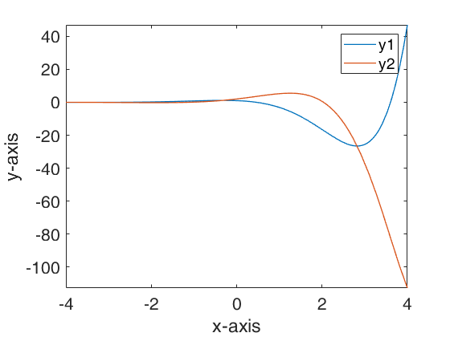
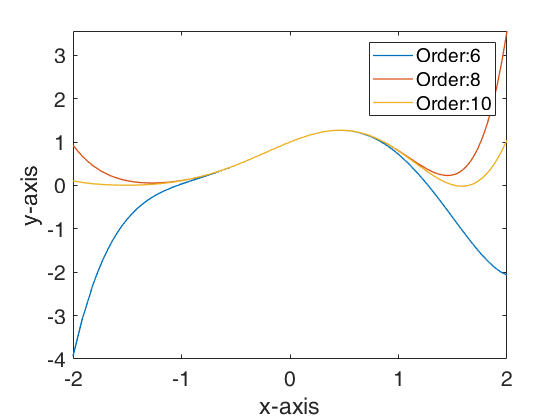
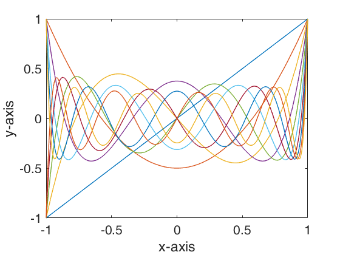

## Contents
* [Exercise 1](#exercise-1)
* [Exercise 2](#exercise-2)
* [Exercise 3](#exercise-3)
* [Exercise 4](#exercise-4)
* [Exercise 5](#exercise-5)
* [Exercise 6](#exercise-6)
* [Exercise 7](#exercise-7)
* [Exercise 8](#exercise-8)
* [Exercise 9](#exercise-9)
* [Exercise 10](#exercise-10)
* [Exercise 11](#exercise-11)
* [Exercise 12](#exercise-12)

**Please note that all the LaTeX formulas are transformed by MathJaX.**

## Exercise 1
```matlab
%% Exercise 1
syms x;
f = (sin(x))^10;
result = int(f);
latex(result)
```

**Results:**

**Please note that correct format should be with an additional constant.**

$$
	\frac{63\,x}{256}-\frac{105\,\sin\left(2\,x\right)}{512}+\frac{15\,\sin\left(4\,x\right)}{256}-\frac{15\,\sin\left(6\,x\right)}{1024}+\frac{5\,\sin\left(8\,x\right)}{2048}-\frac{\sin\left(10\,x\right)}{5120}
$$

## Exercise 2
```matlab
%% Exercise 2
syms x y z;
f = sin(x * y) * exp(x^2 * y * sin(z));
diff_fx = diff(f, x, 2);
diff_fy = diff(diff_fx, y, 2);
diff_fz = diff(diff_fy, z, 1);
result = subs(diff_fz, {x, y, z}, {1, 2, 1});
latex(result)
```

**Results:**

$$
	\begin{aligned}
	    & 288\,\cos\left(1\right)\,\cos\left(2\right)\,{\mathrm{e}}^{2\,\sin\left(1\right)}\,{\sin\left(1\right)}^2 - \\
	    & 40\,\cos\left(1\right)\,{\mathrm{e}}^{2\,\sin\left(1\right)}\,\sin\left(2\right) - \\
	    & 28\,\cos\left(1\right)\,\cos\left(2\right)\,{\mathrm{e}}^{2\,\sin\left(1\right)} + \\
	    & 96\,\cos\left(1\right)\,\cos\left(2\right)\,{\mathrm{e}}^{2\,\sin\left(1\right)}\,{\sin\left(1\right)}^3 + \\
	    & 28\,\cos\left(1\right)\,{\mathrm{e}}^{2\,\sin\left(1\right)}\,{\sin\left(1\right)}^2\,\sin\left(2\right) + \\
	    & 136\,\cos\left(1\right)\,{\mathrm{e}}^{2\,\sin\left(1\right)}\,{\sin\left(1\right)}^3\,\sin\left(2\right) + \\
	    & 32\,\cos\left(1\right)\,{\mathrm{e}}^{2\,\sin\left(1\right)}\,{\sin\left(1\right)}^4\,\sin\left(2\right) + \\
	    & 120\,\cos\left(1\right)\,\cos\left(2\right)\,{\mathrm{e}}^{2\,\sin\left(1\right)}\,\sin\left(1\right) - \\
	    & 168\,\cos\left(1\right)\,{\mathrm{e}}^{2\,\sin\left(1\right)}\,\sin\left(1\right)\,\sin\left(2\right)
    \end{aligned}
$$

## Exercise 3
```matlab
%% Exercise 3
syms a t
x = a * (t - sin(t));
y = a * (1 - cos(t));
result = diff(y, t) / diff(x, t);
latex(result)
```

**Results:**

$$
	-\frac{\sin\left(t\right)}{\cos\left(t\right)-1}
$$

## Exercise 4
```matlab
%% Exercise 4
syms y1(t) y2(t)
eqns = [diff(y1, t) == y1 - y2, diff(y2, t) == y1 + y2];
conds = [y1(0) == 1, y2(0) == 2];
sol = dsolve(eqns, conds);
latex(sol.y1)
latex(sol.y2)
fplot(sol.y1, [-4 4], 'linewidth', 1);
hold on;
fplot(sol.y2, [-4 4], 'linewidth', 1);
hold off;
legend('y1', 'y2');
xlabel('x-axis');
ylabel('y-axis');
set(gca, 'fontsize', 16);
```

**Results:**

$$
	\begin{aligned}
		y_1(t) & = {\mathrm{e}}^t\,\cos\left(t\right)-2\,{\mathrm{e}}^t\,\sin\left(t\right) \\
		y_2(t) & = 2\,{\mathrm{e}}^t\,\cos\left(t\right)+{\mathrm{e}}^t\,\sin\left(t\right)
	\end{aligned}
$$



## Exercise 5
```matlab
%% Exercise 5
syms a1 b1 c1 a2 b2 c2 x y
eqns = [a1 * x + b1 * y == c1, a2 * x + b2 * y == c2];
sol = solve(eqns, [x, y]);
subs(sol.x, {a1, b1, c1, a2, b2, c2}, {1, 2, 3, 3, 2, 1})
subs(sol.y, {a1, b1, c1, a2, b2, c2}, {1, 2, 3, 3, 2, 1})
latex(sol.x) 
latex(sol.y)
```

**Results:**

$$
	\begin{cases}
		x = -\frac{b_{1}\,c_{2}-b_{2}\,c_{1}}{a_{1}\,b_{2}-a_{2}\,b_{1}} \\
		y = \frac{a_{1}\,c_{2}-a_{2}\,c_{1}}{a_{1}\,b_{2}-a_{2}\,b_{1}}
	\end{cases}	
$$

## Exercise 6

```matlab
%% Exercise 6
syms x
y = (cos(x))^2 * exp(x);
t6 = taylor(y, x, 0, 'Order', 6);
t8 = taylor(y, x, 0, 'Order', 8);
t10 = taylor(y, x, 0, 'Order', 10);
latex(t6)
latex(t8)
latex(t10)
fplot(t6, [-2, 2], 'linewidth', 1);
hold on;
fplot(t8, [-2, 2], 'linewidth', 1);
hold on;
fplot(t10, [-2, 2], 'linewidth', 1);
hold off;
legend('Order:6', 'Order:8', 'Order:10');
xlabel('x-axis');
ylabel('y-axis');
set(gca, 'fontsize', 16);
```

**Results:**

**Please note that correct format should be with additional residuals.(Peano form, Lagrange form, etc)**

$$
	\begin{aligned}
		T_6(x) & = \frac{7\,x^5}{40}-\frac{x^4}{8}-\frac{5\,x^3}{6}-\frac{x^2}{2}+x+1 \\
		T_8(x) & = \frac{x^7}{336}+\frac{59\,x^6}{720}+\frac{7\,x^5}{40}-\frac{x^4}{8}-\frac{5\,x^3}{6}-\frac{x^2}{2}+x+1 \\
		T_{10}(x) & = -\frac{599\,x^9}{362880}-\frac{263\,x^8}{40320}+\frac{x^7}{336}+\frac{59\,x^6}{720}+\frac{7\,x^5}{40}-\frac{x^4}{8}-\frac{5\,x^3}{6}-\frac{x^2}{2}+x+1
	\end{aligned}
$$



## Exercise 7

```matlab
%% Exercise 7
A = sym([1, 2, 3; 4, 1, 2; 7, 5, 1]);
[v, d] = eig(A);
latex(v)
latex(d)
latex(det(A))
```

**Results:**

Eigenvalues:

$$
    \begin{aligned}
        & \lambda_1 = \frac{13}{ {\left(44+\sqrt{261}\,{}\mathrm{i}\right)}^{1/3}}+{\left(44+\sqrt{261}\,{}\mathrm{i}\right)}^{1/3}+1\\
        & \lambda_2 = 1-\frac{ {\left(44+\sqrt{261}\,{}\mathrm{i}\right)}^{1/3}}{2}-\frac{13}{2\,{\left(44+\sqrt{261}\,{}\mathrm{i}\right)}^{1/3}}-\frac{\sqrt{3}\,\left(\frac{13}{ {\left(44+\sqrt{261}\,{}\mathrm{i}\right)}^{1/3}}-{\left(44+\sqrt{261}\,{}\mathrm{i}\right)}^{1/3}\right)\,{}\mathrm{i}}{2} \\
        & \lambda_3 = 1-\frac{ {\left(44+\sqrt{261}\,{}\mathrm{i}\right)}^{1/3}}{2}-\frac{13}{2\,{\left(44+\sqrt{261}\,{}\mathrm{i}\right)}^{1/3}}+\frac{\sqrt{3}\,\left(\frac{13}{ {\left(44+\sqrt{261}\,{}\mathrm{i}\right)}^{1/3}}-{\left(44+\sqrt{261}\,{}\mathrm{i}\right)}^{1/3}\right)\,{}\mathrm{i}}{2}
    \end{aligned}
$$

Corresponding eigenvectors:

$$
    v_1 = \left[
    \begin{matrix}
        \frac{5\,{\left(\frac{13}{ {\left(44+\sqrt{261}\,{}\mathrm{i}\right)}^{1/3}}+{\left(44+\sqrt{261}\,{}\mathrm{i}\right)}^{1/3}+1\right)}^2}{2}-\frac{156}{ {\left(44+\sqrt{261}\,{}\mathrm{i}\right)}^{1/3}}-12\,{\left(44+\sqrt{261}\,{}\mathrm{i}\right)}^{1/3}-80, \\
        112+\frac{221}{ {\left(44+\sqrt{261}\,{}\mathrm{i}\right)}^{1/3}}+17\,{\left(44+\sqrt{261}\,{}\mathrm{i}\right)}^{1/3}-\frac{7\,{\left(\frac{13}{ {\left(44+\sqrt{261}\,{}\mathrm{i}\right)}^{1/3}}+{\left(44+\sqrt{261}\,{}\mathrm{i}\right)}^{1/3}+1\right)}^2}{2}, \\
        1
    \end{matrix}
    \right]
$$

$$
    v_2 = \left[
    \begin{matrix}
        \frac{5\,{\left(\frac{13}{2\,{\left(44+\sqrt{261}\,{}\mathrm{i}\right)}^{1/3}}+\frac{ {\left(44+\sqrt{261}\,{}\mathrm{i}\right)}^{1/3}}{2}-1+\frac{\sqrt{3}\,\left(\frac{13}{ {\left(44+\sqrt{261}\,{}\mathrm{i}\right)}^{1/3}}-{\left(44+\sqrt{261}\,{}\mathrm{i}\right)}^{1/3}\right)\,{}\mathrm{i}}{2}\right)}^2}{2}+ \frac{78}{ {\left(44+\sqrt{261}\,{}\mathrm{i}\right)}^{1/3}}+ \\ 6\,{\left(44+\sqrt{261}\,{}\mathrm{i}\right)}^{1/3}-80+\sqrt{3}\,\left(\frac{13}{ {\left(44+\sqrt{261}\,{}\mathrm{i}\right)}^{1/3}}-{\left(44+\sqrt{261}\,{}\mathrm{i}\right)}^{1/3}\right)\,6{}\mathrm{i}, \\
        -\frac{7\,{\left(\frac{13}{2\,{\left(44+\sqrt{261}\,{}\mathrm{i}\right)}^{1/3}}+\frac{ {\left(44+\sqrt{261}\,{}\mathrm{i}\right)}^{1/3}}{2}-1+\frac{\sqrt{3}\,\left(\frac{13}{ {\left(44+\sqrt{261}\,{}\mathrm{i}\right)}^{1/3}}-{\left(44+\sqrt{261}\,{}\mathrm{i}\right)}^{1/3}\right)\,{}\mathrm{i}}{2}\right)}^2}{2}+112-\frac{221}{2\,{\left(44+\sqrt{261}\,{}\mathrm{i}\right)}^{1/3}} \\ -\frac{17\,{\left(44+\sqrt{261}\,{}\mathrm{i}\right)}^{1/3}}{2}-\frac{\sqrt{3}\,\left(\frac{13}{ {\left(44+\sqrt{261}\,{}\mathrm{i}\right)}^{1/3}}-{\left(44+\sqrt{261}\,{}\mathrm{i}\right)}^{1/3}\right)\,17{}\mathrm{i}}{2}, \\
        1
    \end{matrix}
    \right]
$$

$$
    v_3 = \left[
    \begin{matrix}
        \frac{5\,{\left(\frac{13}{2\,{\left(44+\sqrt{261}\,{}\mathrm{i}\right)}^{1/3}}+\frac{ {\left(44+\sqrt{261}\,{}\mathrm{i}\right)}^{1/3}}{2}-1-\frac{\sqrt{3}\,\left(\frac{13}{ {\left(44+\sqrt{261}\,{}\mathrm{i}\right)}^{1/3}}-{\left(44+\sqrt{261}\,{}\mathrm{i}\right)}^{1/3}\right)\,{}\mathrm{i}}{2}\right)}^2}{2}+ \frac{78}{ {\left(44+\sqrt{261}\,{}\mathrm{i}\right)}^{1/3}}+ \\ 6\,{\left(44+\sqrt{261}\,{}\mathrm{i}\right)}^{1/3}-80-\sqrt{3}\,\left(\frac{13}{ {\left(44+\sqrt{261}\,{}\mathrm{i}\right)}^{1/3}}-{\left(44+\sqrt{261}\,{}\mathrm{i}\right)}^{1/3}\right)\,6{}\mathrm{i}, \\
        -\frac{7\,{\left(\frac{13}{2\,{\left(44+\sqrt{261}\,{}\mathrm{i}\right)}^{1/3}}+\frac{ {\left(44+\sqrt{261}\,{}\mathrm{i}\right)}^{1/3}}{2}-1-\frac{\sqrt{3}\,\left(\frac{13}{ {\left(44+\sqrt{261}\,{}\mathrm{i}\right)}^{1/3}}-{\left(44+\sqrt{261}\,{}\mathrm{i}\right)}^{1/3}\right)\,{}\mathrm{i}}{2}\right)}^2}{2} + 112-\frac{221}{2\,{\left(44+\sqrt{261}\,{}\mathrm{i}\right)}^{1/3}} \\ -\frac{17\,{\left(44+\sqrt{261}\,{}\mathrm{i}\right)}^{1/3}}{2}+\frac{\sqrt{3}\,\left(\frac{13}{ {\left(44+\sqrt{261}\,{}\mathrm{i}\right)}^{1/3}}-{\left(44+\sqrt{261}\,{}\mathrm{i}\right)}^{1/3}\right)\,17{}\mathrm{i}}{2}, \\
        1
    \end{matrix}
    \right]
$$

## Exercise 8

```matlab
%% Exercise 8
syms x
f = (cos(x))^(1/x^3);
latex(limit(f, x, 0))
latex(limit(f, x, 0, 'left'))
latex(limit(f, x, 0, 'right'))
```

**Results:**

Limit:$ \mathrm{NaN} $

Left limit: $ \infty $

Right limit: $ 0 $

## Exercise 9

```matlab
%% Exercise 9
syms x y
F = log(x) + exp(-y / x) - exp(1);
result = -diff(F, x) / diff(F, y);
latex(result)
```

**Results:**

$$
	\,{\mathrm{e}}^{y/x}\,\left(\frac{1}{x}+\frac{y\,{\mathrm{e}}^{-\frac{y}{x}}}{x^2}\right)
$$

## Exercise 10

```matlab
%% Exercise 10
syms x y z
F = sin(x * y) + cos(y * z) + tan(x * z);
pzpx = -diff(F, x) / diff(F, z);
pzpy = -diff(F, y) / diff(F, z);
latex(pzpx)
latex(pzpy)
```

**Results:**

$$
	\begin{aligned}
		\frac{\partial z}{\partial x} & = -\frac{z\,\left({\mathrm{tan}\left(x\,z\right)}^2+1\right)+y\,\cos\left(x\,y\right)}{x\,\left({\mathrm{tan}\left(x\,z\right)}^2+1\right)-y\,\sin\left(y\,z\right)} \\
    	\frac{\partial z}{\partial y} & = -\frac{x\,\cos\left(x\,y\right)-z\,\sin\left(y\,z\right)}{x\,\left({\mathrm{tan}\left(x\,z\right)}^2+1\right)-y\,\sin\left(y\,z\right)}
	\end{aligned}
$$

## Exercise 11

```matlab
%% Exercise 11
syms x y;
f = 2 * x^2 * sin(y) + 3 * x * y^2;
fy = int(f, y, 0, x);
fx = int(fy, x, 0, 3);
latex(fx)
```

**Results:**

$$
	\frac{333}{5}-14\,\sin\left(3\right)-12\,\cos\left(3\right)
$$

## Exercise 12

```matlab
%% Exercise 1
syms x;
f = (sin(x))^10;
result = int(f);
latex(result)
```

**Results:**

Legendre polynomials:

$$
	\begin{aligned}
	    & p_1(x) = x \\
	    & p_2(x) = \frac{3\,x^2}{2}-\frac{1}{2} \\
	    & p_3(x) = \frac{x\,\left(5\,x^2-3\right)}{2} \\
	    & p_4(x) = \frac{35\,x^4}{8}-\frac{15\,x^2}{4}+\frac{3}{8} \\
	    & p_5(x) = \frac{x\,\left(63\,x^4-70\,x^2+15\right)}{8} \\
	    & p_6(x) = \frac{231\,x^6}{16}-\frac{315\,x^4}{16}+\frac{105\,x^2}{16}-\frac{5}{16} \\
	    & p_7(x) = \frac{x\,\left(429\,x^6-693\,x^4+315\,x^2-35\right)}{16} \\
	    & p_8(x) = \frac{6435\,x^8}{128}-\frac{3003\,x^6}{32}+\frac{3465\,x^4}{64}-\frac{315\,x^2}{32}+\frac{35}{128} \\
	    & p_9(x) = \frac{x\,\left(12155\,x^8-25740\,x^6+18018\,x^4-4620\,x^2+315\right)}{128} \\
	    & p_{10}(x) = \frac{46189\,x^{10}}{256}-\frac{109395\,x^8}{256}+\frac{45045\,x^6}{128}-\frac{15015\,x^4}{128}+\frac{3465\,x^2}{256}-\frac{63}{256}
	\end{aligned}
$$

**As the roots of these polynomial cost much space, we are going to ignore them here.**

