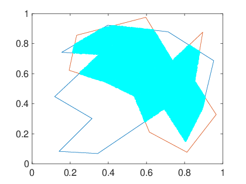

## Contents
* [Exercise 1](#exercise-1)
* [Exercise 2](#exercise-2)
* [Exercise 3](#exercise-3)
* [Exercise 4](#exercise-4)
* [Appendix A](#appendix-a)
* [Appendix B](#appendix-b)

**Please note that all the LaTeX formulas are transformed by MathJaX.**

## Exercise 1
```matlab
% MatLab built-in integral
func1 = @(x) exp(-x.^2) ./ (1 + x.^4);
func2 = @(x) sin(x) ./ sqrt(1 - x.^2);
func3 = @(theta, r)(1 + cos(theta) + 1 + sin(theta)) .* r;

result1 = integral(func1, -inf, +inf);
result2 = integral(func2, 0, 1);
result3 = integral2(func3, 0, 2 * pi, 0, 1);

% Monte-Carlo method
% question 1: make substitution x = arctan(t) to use finite method
value1 = monte_carlo1(@(t) func1(atan(t)) ./ (1 + t.^2), -pi / 2, pi / 2, 1000000);
(value1 - result1) / result1

% question 1 method 2: using truncating function
value2 = monte_carlo1(func1, -100, 100, 1000000);
(value2 - result1) / result1

% question 3: make polar substitution
value3 = monte_carlo1(func3, 0, 2 * pi, 1000000);
(value3 - result3) / result3

function value = monte_carlo1(funct, lb, ub, total_number)
    [~, minv] = fminbnd(funct, lb, ub);
    functmax = @(x) -funct(x);
    [~, maxv] = fminbnd(functmax, lb, ub);
    maxv = -maxv;
    x = unifrnd(lb, ub, [1, total_number]);  
    y = unifrnd(minv, maxv, [1, total_number]);
    freq = sum(y <= funct(x) & y >= minv); % count values which are in minv and maxv
    value = (ub - lb) * (maxv - minv) * freq / total_number + minv * (ub - lb); % calculate value
end
```

**Results:**

* Using built in functions:

$$
	\begin{aligned}
	    & \int_{-\infty}^{\infty} \frac{\exp{-x^2}}{1 + x^4} \mathrm{d} x \approx 1.4348 \\
	    & \int_{0}^{1} \frac{\sin{x}}{\sqrt{1 - x^2}} \mathrm{d} x \approx 0.8932 \\
	    & \iint_{x^2 + y^2 \leqslant 2y} (1 + x + y) \mathrm{d} x \mathrm{d} y \approx 6.2832 
	\end{aligned}	
$$

* Using Monte Carlo method:

$$
	\begin{aligned}
	    & \int_{-\infty}^{\infty} \frac{\exp{-x^2}}{1 + x^4} \mathrm{d} x \approx 1.3559 \quad \mbox{Using substitution} \\
	    & \int_{-\infty}^{\infty} \frac{\exp{-x^2}}{1 + x^4} \mathrm{d} x \approx 1.4316 \quad \mbox{Using truncating functions} \\
	    & \iint_{x^2 + y^2 \leqslant 2y} (1 + x + y) \mathrm{d} x \mathrm{d} y \approx 6.2824
	\end{aligned}	
$$

## Exercise 2
```matlab
%% Exercise 2
gauss_legendre_coeff(2)
gauss_legendre_coeff(3)
gauss_legendre_coeff(4)

function gauss_legendre_coeff(total_vars)
    % constructing variables and symbols
    argument = sym('a', [1 total_vars]);
    variable = sym('x', [1 total_vars]);

    % constucting equations
    for i = 1: 2 * total_vars
        if (mod(i, 2) == 1)
            key = sym(2 / i);
        else
            key = sym(0);
        end
        equations(i) = sum(argument .* variable .^ (i - 1)) == key;
    end

    % solving equations
    sol = solve(equations, 'PrincipalValue', true);
    sol = struct2cell(sol);
    
    % displaying results
    disp("-- Gauss-Legendre coeffcient where order is " + total_vars + " --");
    for i = 1: total_vars
        disp("a" + int2str(i) + ": " + string(sol{i}) + ", x" + int2str(i) + ": " + string(sol{i + total_vars}));
    end
end
```

**Results:**

* Order 3:

$$
\begin{aligned}
    & a_1 = 1, x_1 = \frac{\sqrt{3}}{3} \\ 
    & a_2 = 1, x_2 = -\frac{\sqrt{3}}{3}
\end{aligned}
$$

* Order 5:

$$
\begin{aligned}
    & a_1 = \frac{5}{9}, x_1 = \frac{\sqrt{15}}{5} \\ 
    & a_2 = \frac{5}{9}, x_2 = -\frac{\sqrt{15}}{5} \\
    & a_3 = \frac{8}{9}, x_3 = 0
\end{aligned}
$$

* Order 7:

$$
\begin{aligned}
    & a_1 = \frac{1}{2}-\frac{\sqrt{30}}{36}, x_1 = \frac{\sqrt{7}\,\sqrt{\frac{2\,\sqrt{30}}{5}+3}}{7} \\
    & a_2 = \frac{1}{2}-\frac{\sqrt{30}}{36}, x_2 = -\frac{\sqrt{7}\,\sqrt{\frac{2\,\sqrt{30}}{5}+3}}{7} \\
    & a_3 = \frac{\sqrt{30}}{36}+\frac{1}{2}, x_3 = \sqrt{\frac{3}{7}-\frac{2\,\sqrt{30}}{35}} \\
    & a_4 = \frac{\sqrt{30}}{36}+\frac{1}{2}, x_4 = -\sqrt{\frac{3}{7}-\frac{2\,\sqrt{30}}{35}}    
\end{aligned}
$$

## Exercise 3
```matlab
%% Exercise 3
generic_integral_coeff(2, @(x) sqrt(x), 0, 1)
generic_integral_coeff(3, @(x) sqrt(x), 0, 1)
generic_integral_coeff(4, @(x) sqrt(x), 0, 1)

generic_integral_coeff(2, @(x) 1 ./ sqrt(1 - x .^ 2), -1, 1)
generic_integral_coeff(3, @(x) 1 ./ sqrt(1 - x .^ 2), -1, 1)
generic_integral_coeff(4, @(x) 1 ./ sqrt(1 - x .^ 2), -1, 1)

generic_integral_coeff(2, @(x) exp(-x), 0, +inf)
generic_integral_coeff(3, @(x) exp(-x), 0, +inf)
generic_integral_coeff(4, @(x) exp(-x), 0, +inf)

generic_integral_coeff(2, @(x) exp(-x .^ 2), -inf, +inf)
generic_integral_coeff(3, @(x) exp(-x .^ 2), -inf, +inf)
generic_integral_coeff(4, @(x) exp(-x .^ 2), -inf, +inf)

function generic_integral_coeff(total_vars, funct, left, right)
    if (nargin == 1)
        funct = @(x) 1;
    elseif (nargin == 2)
        left = -1;
        right = 1;
    end
    % constructing variables and symbols
    argument = sym('a', [1 total_vars]);
    variable = sym('x', [1 total_vars]);

    % constucting equations
    sym_funct = sym(funct);
    for i = 1: 2 * total_vars
        key = int(sym_funct .* sym(@(x) x .^ (i - 1)), left, right);
        equations(i) = sum(argument .* variable .^ (i - 1)) == key;
    end

    % solving equations
    sol = solve(equations, 'PrincipalValue', true);
    %sol = vpasolve(equations);
    sol = struct2cell(sol);
    
    % displaying results
    disp("-- Generic integral coeffcient where order is " + total_vars + " --");
    for i = 1: total_vars
        disp("a" + int2str(i) + ": " + string(sol{i}) + ", x" + int2str(i) + ": " + string(sol{i + total_vars}));
    end
end
```

**Results:**

$$
	\rho(x) = \sqrt{x}, \mbox{with an interval of $[0, 1]$}:
$$

* Order 3:

$$
\begin{aligned}
    & a_1 = 0.38911, x_1 = 0.82116 \\
    & a_2 = 0.27756, x_2 = 0.28995
\end{aligned}
$$

* Order 5:

$$
\begin{aligned}
    & a_1 = 0.23328, x_1 = 0.90081 \\
    & a_2 = 0.3076, x_2 = 0.54987 \\
    & a_3 = 0.12578, x_3 = 0.16471
\end{aligned}
$$

* Order 7:

$$
\begin{aligned}
    & a_1 = 0.15236, x_1 = 0.93733 \\
    & a_2 = 0.25253, x_2 = 0.69895 \\
    & a_3 = 0.1961, x_3 = 0.37622 \\
    & a_4 = 0.065681, x_4 = 0.10514   
\end{aligned}
$$


$$
	\rho(x) = \frac{1}{\sqrt{1 - x^2}}, \mbox{with an interval of $[-1, 1]$}:
$$

* Order 3:

$$
	a_{1, 2} = \frac{\pi}{2}, x_1 = \frac{\sqrt{2}}{2}, x_2 = -\frac{\sqrt{2}}{2}
$$

* Order 5:

$$
    a_{1, 2, 3} = \frac{\pi}{3}, x_1 = \frac{\sqrt{3}}{2}, x_2 = 0, x_3 = -\frac{\sqrt{3}}{2}
$$

* Order 7:

$$
    a_{1, 2, 3, 4} = \frac{\pi}{4}, x_1 = \frac{\sqrt{2 + \sqrt{2}}}{2}, x_2 = \frac{\sqrt{2 - \sqrt{2}}}{2}, x_3 = -\frac{\sqrt{2 - \sqrt{2}}}{2}, x_4 = \frac{\sqrt{2 + \sqrt{2}}}{2}
$$


$$
	\rho(x) = \exp{(-x)}, \mbox{with an interval of $[0, \infty)$}:
$$

* Order 3:

$$
\begin{aligned}
    & a_1 = 0.14645, x_1 = 3.1412 \\
    & a_2 = 0.85355, x_2 = 0.58579
\end{aligned}
$$

* Order 5:

$$
\begin{aligned}
    & a_1 = 0.010389, x_1 = 6.2899 \\
    & a_2 = 0.27852, x_2 = 2.2943 \\
    & a_3 = 0.71109, x_3 = 0.41577
\end{aligned}
$$

* Order 7:

$$
\begin{aligned}
    & a_1 = 5.3929 \times 10^{-4}, x_1 = 9.3951 \\
    & a_2 = 0.038888, x_2 = 4.5366 \\
    & a_3 = 0.35742, x_3 = 1.7458 \\
    & a_4 = 0.60315, x_4 = 0.32255
\end{aligned}
$$

$$
	\rho(x) = \exp{(-x^2)}, \mbox{with an interval of $[-\infty, +\infty]$}:
$$

* Order 3:

$$
\begin{aligned}
    & a_1 = \frac{\sqrt{\pi}}{2}, x_1 = \frac{\sqrt{2}}{2} \\ 
    & a_2 = \frac{\sqrt{\pi}}{2}, x_2 = -\frac{\sqrt{2}}{2}
\end{aligned}
$$

* Order 5:

$$
\begin{aligned}
    & a_1 = \frac{\sqrt{\pi }}{6}, x_1 = \frac{\sqrt{6}}{2} \\ 
    & a_2 = \frac{2\,\sqrt{\pi }}{3}, x_2 = 0 \\
    & a_3 = \frac{\sqrt{\pi }}{6}, x_3 = -\frac{\sqrt{6}}{2}
\end{aligned}
$$

* Order 7:

$$
\begin{aligned}
    & a_1 = \frac{\sqrt{\pi }}{4(3 - \sqrt{6})}, x_1 = -\sqrt{\frac{3}{2} - \sqrt{\frac{3}{2}}} \\
    & a_2 = \frac{\sqrt{\pi }}{4(3 - \sqrt{6})}, x_2 = \sqrt{\frac{3}{2} - \sqrt{\frac{3}{2}}} \\
    & a_3 = \frac{\sqrt{\pi }}{4(3 + \sqrt{6})}, x_3 = -\sqrt{\frac{3}{2} + \sqrt{\frac{3}{2}}} \\
    & a_4 = \frac{\sqrt{\pi }}{4(3 + \sqrt{6})}, x_4 = \sqrt{\frac{3}{2} + \sqrt{\frac{3}{2}}}  
\end{aligned}
$$

## Exercise 4
```matlab
%% Exercise 4
% ginput test
[x1, y1] = ginput(); % first polynomial
plot([x1; x1(1)], [y1; y1(1)])
hold on;
[x2, y2] = ginput(); % second polynomial
plot([x2; x2(1)], [y2; y2(1)])
drawnow;
hold on;

square = calculate_square(x1, y1, x2, y2, 100000);
square

function final_square = calculate_square(x1, y1, x2, y2, total_points, epsilon)
    if (nargin == 5)
        epsilon = 1e-6;
    end

    x_min = min(min(x1), min(x2));
    x_max = max(max(x1), max(x2));
    y_min = min(min(y1), min(y2));
    y_max = max(max(y1), max(y2));

    total_square = (x_max - x_min) * (y_max - y_min);

    random_points = rand(total_points, 2);
    x_points = x_min * ones(total_points, 1) + (x_max - x_min) * random_points(:, 1);
    y_points = y_min * ones(total_points, 1) + (y_max - y_min) * random_points(:, 2);
    in_points = 0;

    valid = [];
    for i = 1: total_points
        if (interior([x_points(i) y_points(i)], x1, y1, epsilon) && (interior([x_points(i) y_points(i)], x2, y2, epsilon)))
            in_points = in_points + 1;
            valid = [valid; x_points(i), y_points(i)];
        end
    end

    scatter(valid(:, 1), valid(:, 2), 5, 'cyan');
    hold off;

    final_square = in_points / total_points * total_square;
end

function result = interior(point, xpoints, ypoints, epsilon)
    % judging a point is an interior of a polynomial
    if (nargin == 3)
        epsilon = 1e-6;
    end
    
    if (size(xpoints, 1) ~= size(ypoints, 1))
        error("Incompatible points");
    end
    
    number = size(xpoints, 1);
    angle_sum = 0;
    for i = 1: number
        angle_sum = angle_sum + get_angle(point, [xpoints(i) ypoints(i)], [xpoints(mod(i, number) + 1) ypoints(mod(i, number) + 1)]);
    end
    if (abs(abs(angle_sum) - 2 * pi) < epsilon)
        result = true;
    else
        result = false;
    end
    
end

function angle = get_angle(point1, point2, point3, epsilon)
    % calculate the angle through point 1 between point 2 and point 3
    if (nargin == 3)
        epsilon = 1e-6;
    end
    angle = acos((point2 - point1) * (point3 - point1)' / (norm(point2 - point1) * norm(point3 - point1)));
    validate_point3 = point1 + (point2 - point1) * [cos(angle) -sin(angle); sin(angle) cos(angle)] / norm(point2 - point1) * norm(point3 - point1);
    if (norm(validate_point3 - point3) >= epsilon)
        angle = -angle; % reverse rotation
    end
end
```

**Results:**



## Appendix A

This appendix is an extension of [Exercise 1](#exercise-1). Dimension is broadened here.

```matlab
% MatLab built-in integral
func1 = @(x) exp(-x.^2) ./ (1 + x.^4);
func2 = @(x) sin(x) ./ sqrt(1 - x.^2);
func3 = @(theta, r) r .* (1 + r.*cos(theta) + 1 + r.*sin(theta));

result1 = integral(func1, -inf, +inf);
result2 = integral(func2, 0, 1);
result3 = integral2(func3, 0, 2 * pi, 0, 1);

result1, result2, result3

func3 = @(x) x(2) .* (2 + x(2) * cos(x(1)) + x(2) * sin(x(1)));

% Monte-Carlo method
% question 1: make substitution x = arctan(t) to use finite method
value1 = monte_carlo(@(t) func1(atan(t)) ./ (1 + t.^2), 1, 1000000, -pi / 2, pi / 2);
(value1 - result1) / result1

% question 1 method 2: using truncating function
value2 = monte_carlo(func1, 1, 1000000, -100, 100);
(value2 - result1) / result1

% question 3: make polar substitution
value3 = monte_carlo(func3, 2, 1000000, [0, 0], [2 * pi, 1]);
(value3 - result3) / result3

function value = monte_carlo(funct, dimension, iteration, lb, ub)
    % monte-carlo main method
    points = zeros(dimension, iteration);
    total_value = 0;
    for i = 1: dimension
        points(i, :) = generate_random_points(iteration, lb(i), ub(i));
    end
    for j = 1: iteration
        total_value = total_value + funct(points(:, j)');
    end
    value = total_value * prod(ub - lb) / iteration;
end

function point = generate_random_points(numbers, lb, ub)
    % random point generator by uniform distribution
    point = lb + (ub - lb) .* rand(1, numbers);
end
```

## Appendix B

This appendix is an extension of [Exercise 2](#exercise-2). Precision is greatly increased here.

```matlab
function result = generic_gauss_integral(funct, lb, ub, density, coeff, points)
    % generic_gauss_integral calculates generic integrals using 
    % Gauss-Legendre integral method.
    % funct: the function to be integrated
    % lb: lower bound of the integral, default = -1
    % ub: upper bound of the integral, default = 1
    % interval: intervals of the integral segmentations, default = 1000
    % coeff: coefficients of the approximation in the integral, default =
    % Gauss-Legendre coefficients of 3-order precision
    % points: nodes to use in the integral, default = Gauss-Legendre nodes
    % of 3-order precision
    
    % Parameter completing
    if (nargin == 1)
        lb = -1;
        ub = 1;
        density = 50;
        coeff = [1, 1];
        points = [sqrt(3) / 3, -sqrt(3) / 3];         
    elseif (nargin == 3)
        density = 50;
        coeff = [1, 1];
        points = [sqrt(3) / 3, -sqrt(3) / 3]; 
    elseif (nargin == 4)    
        coeff = [1, 1];
        points = [sqrt(3) / 3, -sqrt(3) / 3]; 
    end
    
    % Parameter checking
    if (lb > ub) || (density <= 0) || (size(coeff, 2) ~= size(points, 2))
        error('Incompatible parameters');
    end
    
    interval = (ub - lb) * density;
    result = 0;
    for i = 1: interval
        lb_now = lb + (i - 1) / interval * (ub - lb);
        ub_now = lb_now + (ub - lb) / interval;
        [coeff_a, coeff_b] = interval_transform(lb_now, ub_now, -1, 1);
        result = result + interval_sum(@(x)funct(x), coeff, (points - coeff_b * ones(size(points))) / coeff_a) / coeff_a;
    end
end

function [coeff_a, coeff_b] = interval_transform(lb, ub, nlb, nub)
    coeff_a = (nub - nlb) / (ub - lb);
    coeff_b = -(nub * lb - nlb * ub) / (ub - lb);
end

function interval = interval_sum(funct, coeff, points)    
    interval = 0;
    for i = 1: size(coeff, 2)
        interval = interval + coeff(i) * funct(points(i));
    end
end
```