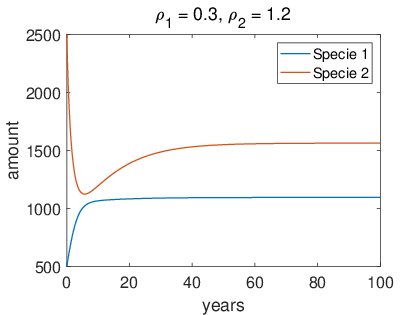
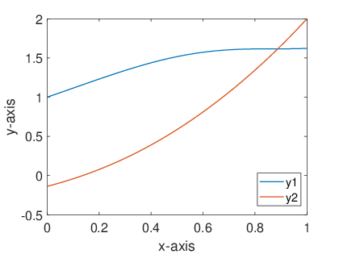
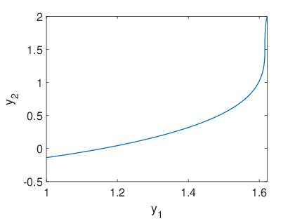
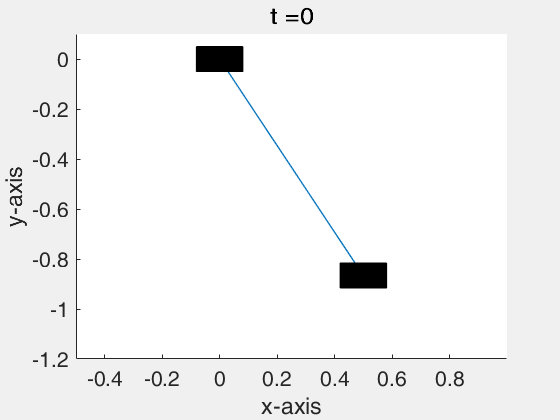

## Contents
* [Exercise 1](#exercise-1)
* [Exercise 2](#exercise-2)
* [Exercise 3](#exercise-3)

## Exercise 1
```matlab
r1 = 0.5; % variable here
r2 = 0.5; % variable here
rho1 = 0.3; % variable here
rho2 = 1.2; % variable here
N1 = 1000;
N2 = 5000;

options = odeset('RelTol',1e-12,'AbsTol',[1e-10 1e-10]);
[t, x] = ode45(@(t, x)rigid(t, x, r1, r2, rho1, rho2, N1, N2), [0 100], [N1 / 2, N2 / 2], options); % Solve the function

plot(t, x(:, 1), 'linewidth', 1);
hold on;
plot(t, x(:, 2), 'linewidth', 1);
hold off;
set(gca, 'fontsize', 16);
xlabel('year');
ylabel('amount');
legend(['Specie 1'; 'Specie 2'])

function dx = rigid(t, x, r1, r2, rho1, rho2, N1, N2)
    dx = zeros(2, 1);
    dx(1) = r1 * x(1) * (1 - x(1) / N1 + rho1 * x(2) / N2);
    dx(2) = r2 * x(2) * (-1 - x(2) / N2 + rho2 * x(1) / N1);
end
```

**Results:**



## Exercise 2
```matlab
solinit = bvpinit(linspace(0, 1, 10), [2 1]);
sol = bvp4c(@twoode, @twobc, solinit);
x = linspace(0, 1);
y = deval(sol, x);

figure(1)
plot(x, y(1, :), 'linewidth', 1);
hold on;
plot(x, y(2, :), 'linewidth', 1);
hold off;
set(gca, 'fontsize', 16);
xlabel('x-axis');
ylabel('y-axis');
legend(['y1'; 'y2'])

figure(2)
plot(y(1, :), y(2, :), 'linewidth', 1);
xlabel('y_1');
ylabel('y_2');
set(gca, 'fontsize', 16);

function dydx = twoode(x, y)
    dydx = [y(1) .* (1 - sin(y(2))); y(1) + y(2)];
end

function res = twobc(ya, yb)
    res = [ya(1) - 1; yb(2) - 2];
end
```

**Results:**





## Exercise 3
```matlab
g = 9.8;
l = 1;
m1 = 1;
m2 = 1;
M = m2 / (m1 + m2);
init_theta = pi / 6;

options = odeset('RelTol',1e-12,'AbsTol',[1e-10 1e-10 1e-10 1e-10]);
[t, x] = ode45(@(t, x)rigid(t, x, M, g, l), [0 10], [init_theta, 0, 0, 0], options); % Solve the function
figure(1)
plot(t, x(:, 1), 'linewidth', 1);
hold on;
plot(t, x(:, 2), 'linewidth', 1);
hold on;
plot(t, x(:, 3), 'linewidth', 1);
hold on;
plot(t, x(:, 4), 'linewidth', 1);
hold off;
set(gca, 'fontsize', 16);
xlabel('x-axis');
ylabel('y-axis');
legend(['y_1'; 'y_2'; 'y_3'; 'y_4'])

for i = 1: size(t, 1)
    p1 = [x(i, 3), 0];
    p2 = [x(i, 3) + l * sin(x(i)), -l * cos(x(i))];
    line([p1(1) p2(1)], [p1(2) p2(2)], 'linewidth', 1);
    rectangle('Position', [p1(1) - l / 12.36, p1(2) - l / 20, l / 6.18, l / 10], 'facecolor', [0, 0, 0]);
    rectangle('Position', [p2(1) - l / 12.36, p2(2) - l / 20, l / 6.18, l / 10], 'facecolor', [0, 0, 0]);
    axis([l * min(sin(x(:, 1))), l * max(sin(x(:, 2))), -l * 1.2, l / 10])
    set(gca, 'fontsize', 16);
    title(strcat('t = ', num2str(t(i))));
    xlabel('x-axis');
    ylabel('y-axis');
    drawnow;
    if i ~= size(t, 1)
        cla reset;
    end
end

function dx = rigid(t, x, M, g, l)
    dx = zeros(4, 1);
    dx(1) = x(2);
    dx(2) = (-M * cos(x(1)) * sin(x(1)) * (dx(1))^2 - g / l * sin(x(1))) / (1 - M * cos(x(1))^2);
    dx(3) = x(4);
    dx(4) = (M * g * sin(x(1)) * cos(x(1)) + M * l * sin(x(1)) * (dx(1))^2) / (1 - M * cos(x(1))^2);
end
```

**Results:**

