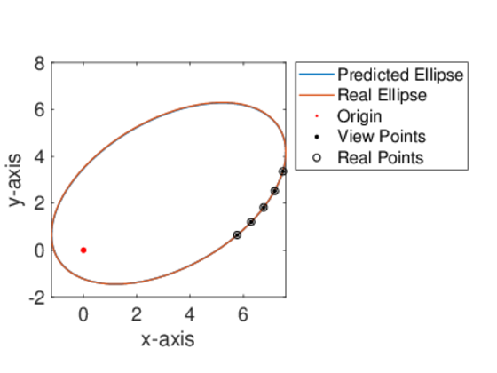
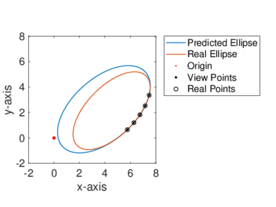
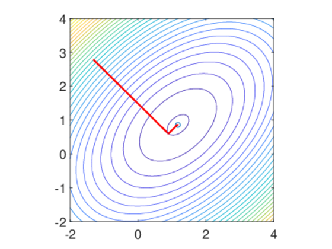
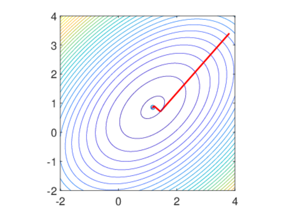
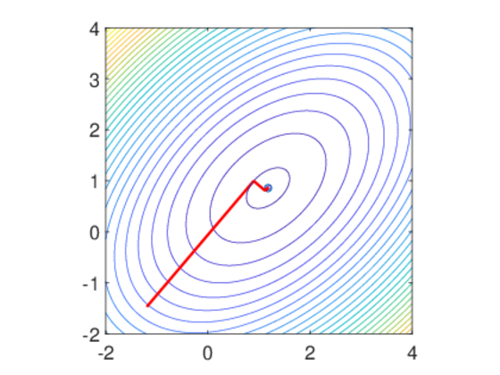
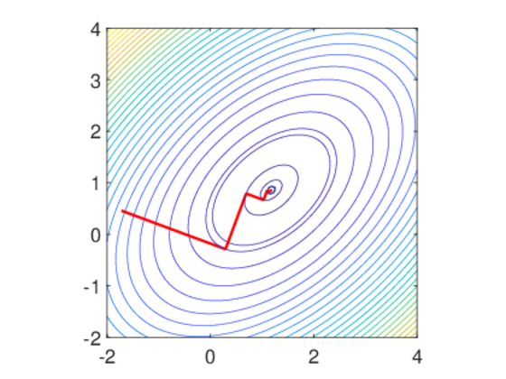
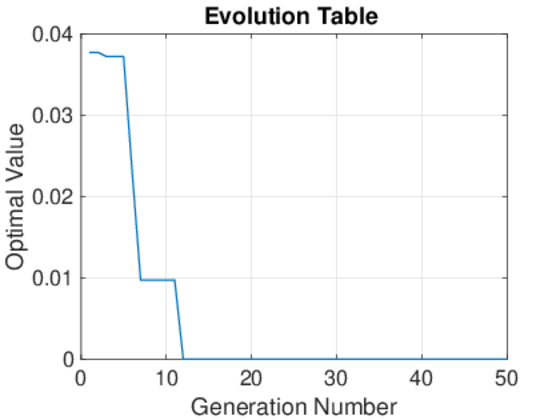

## Contents
* [Exercise 1](#exercise-1)
* [Exercise 2](#exercise-2)
* [Exercise 3](#exercise-3)
* [Exercise 4](#exercise-4)
* [Appendix A](#appendix-a)

## Exercise 1
```matlab
f = @(x) 0.5 + ((sin(sqrt(x(1).^2 + x(2).^2))).^2 - 0.5) ./ (1 + 0.001.*(x(1).^2 + x(2).^2)).^2;
x0 = [5 15];

options = optimset;
options.LargeScale = 'on';
options.Algorithm = 'trust-region';
[x1, fval1, exitflag1, output1] = fminunc(f, x0, options);

options = optimset;
options.LargeScale = 'off';
options.HessUpdate = 'steepdesc';
options.LineSearchType = 'quadratic';
[x2, fval2, exitflag2, output2] = fminunc(f, x0, options);

options = optimset;
options.LargeScale = 'off';
options.HessUpdate = 'bfgs';
options.LineSearchType = 'quadratic';
[x3, fval3, exitflag3, output3] = fminunc(f, x0, options);

options = optimset;
options.HessUpdate='dfp';
options.LineSearchType = 'quadratic';
[x4, fval4, exitflag4, output4] = fminunc(f, x0, options);
```

**Results:**

With an initial point of [1, 1]:

Method | Optimal Solution | Optimal Value | Iteration
 :-: | :-: | :-: | :-:
Trust Region | [0, 0] | 0 | 4
Steepest Descent | [0, 0] | 0 | 3
BFGS | [0, 0] | 0 | 4
DFP | [0, 0] | 0 | 4

## Exercise 2
```matlab
[x, fval] = fmincon(@(x)-x(1).*x(2).*x(3), [0; 0; 0], [-1, -2, -2; 1, 2, 2], [0; 72], [], [], [0; 0; 0], [])
```

**Results:**

```
Optimal solution = [24, 12, 12].
Optimal value = -3456.
```

## Exercise 3
```matlab
% data-based
x = [5.764 6.286 6.759 7.168 7.480];
y = [0.648 1.202 1.823 2.526 3.360];

% randomize for a real value
randomizex = 0.9995 + 0.001 * rand(1, 5);
randomizey = 0.9995 + 0.001 * rand(1, 5);
x_real = x .* randomizex;
y_real = y .* randomizey;

result = linear_equation_solution(x, y);
real_result = linear_equation_solution(x_real, y_real);
figure(1);
fimplicit(@(x, y) x.^2 + result(1)*x.*y + result(2).*y.^2 + result(3)*x + ...
                         result(4)*y + result(5), [-2 8], 'linewidth', 1);
hold on;
fimplicit(@(x, y) x.^2 + real_result(1)*x.*y + real_result(2).*y.^2 + real_result(3)*x + ...
                         real_result(4)*y + real_result(5), [-2 8], 'linewidth', 1);
hold on;
scatter(0, 0, 200, '.r');
hold on;
plot(x, y, 'k.', 'MarkerSize', 10);
hold on;
plot(x_real, y_real, 'ko');
hold off;
set(gca, 'fontsize', 16);
xlabel('x-axis');
ylabel('y-axis');
axis square;
legend(["Predicted Ellipse"; "Real Ellipse"; "Origin"; "View Points"; "Real Points"], 'Location','NorthEastOutside');

[ea, eb] = elliptic_solution(x, y);
[ea_real, eb_real] = elliptic_solution(x_real, y_real);
figure(2);
plot(ea, eb, 'linewidth', 1);
hold on;
plot(ea_real, eb_real, 'linewidth', 1);
hold on;
scatter(0, 0, 200, '.r');
hold on;
plot(x, y, 'k.', 'MarkerSize', 10);
hold on;
plot(x_real, y_real, 'ko');
hold off;
set(gca, 'fontsize', 16);
xlabel('x-axis');
ylabel('y-axis');
axis square;
legend(["Predicted Ellipse"; "Real Ellipse"; "Origin"; "View Points"; "Real Points"], 'Location','NorthEastOutside');

function result = linear_equation_solution(x, y)
    % Solving problem using linear equation
    A = [x.*y; y.^2; x; y; ones(1, 5)]';
    b = transpose(-x.^2);
    result = A \ b;
end

function [ea, eb] = elliptic_solution(x, y)
    % Solving problem using optimization
    f = @(t) sum(abs(sqrt(x.^2 + y.^2) + sqrt((x - t(1)).^2 + (y - t(2)).^2) - 2 .* t(3)));
    options = optimset('fmincon');
    options.TolFun = 1e-12;
    options.TolProjCGAbs = 1e-12;
    options.TolCon = 1e-12;
    options.Display = 'off';
    [result2, ~, ~] = fmincon(f, [0 0 0], [], [], [], [], [-inf -inf 0], [inf inf inf], [], options);
    x0 = result2(1); y0 = result2(2);
    xc = x0 / 2; yc = y0 / 2;
    a = result2(3);
    c = sqrt(x0.^2 + y0.^2) / 2;
    ecc = c / a;
    offset = rad2deg(atan2(y0, x0));
    [ea, eb] = ellipse1(xc, yc, [a, ecc], offset);
end
```

**Results:**





## Exercise 4
```matlab
syms x1 x2 h; % symbolic values, h represents step.
max_iter = 1000; % maximum iteration
eps = 1e-3; % precisiion
func = 8 * x1^2 + 9 * x2^2 - 8 * x1 * x2 - 12 * x1 - 6*x2; 
a = -2; b = 4;
xmin = a; xmax = b; ymin = a; ymax = b;
X1 = linspace(xmin, xmax, 100);
X2 = linspace(ymin, ymax, 100);
[xx, yy] = meshgrid(X1, X2);
zz = 8 * xx.^2 + 9 * yy.^2 - 8 * xx .* yy - 12 * xx - 6 * yy;
contour(xx, yy, zz, 30);
axis([xmin xmax ymin ymax]);
hold on;
axis equal;
plot(33/28, 6/7, 'o'); % minimum value
v = [x1 x2];
df = gradient(func, v);

[x0(1), x0(2)] = ginput(1); % randomize initial points
plot(x0(1), x0(2), 'r', 'MarkerSize',10);
hold on;
fun = matlabFunction(func); 
iter=1;
set(gca, 'fontsize', 16);

while iter <= max_iter
    df0 = subs(df, v, x0);
    d = -df0; % fastest descend for the direction
    fun0 = fun(x0(1) + h * d(1), x0(2) + h * d(2));
    [h0, fval] = fminbnd(matlabFunction(fun0), 0, 1000); % calculate minimum
    temp = x0;
    x0(1) = x0(1) + h0 * d(1); 
    x0(2) = x0(2) + h0 * d(2);
    x = [temp(1) x0(1)]; 
    y = [temp(2) x0(2)];
    H_line2 = plot(x,y); 
    contour(xx, yy, zz, [fval fval],'-'),
    set(H_line2, 'color', 'red', 'linewidth', 2); % draw plot
    iter = iter + 1;
    if norm(x0 - temp) < eps 
        break; % break iteration if two points are very near
    end
end
```

**Results:**









## Exercise A

**Please note that the codes below should be executed with GA Toolbox.**

```matlab
function [bestx, optimal] = ezga(fun, nvars, lb, ub)
    % CHANGE THE FUNCTION FIRST IF YOU WANT A MAXIMUM SEARCH

    % Configuration.Basics
    PopulationNumber = 50;
    MaxGeneration = 50;
    GenerationGap = 0.95;   
    % Configuration.Selection
    SEL_Function = 'rws'; % rws or sus
    CrossoverProb = 0.7;  
    % Configuration.Recombination
    REC_Function = 'xovsp'; % recdis or xovsp
    InsertOption = 1; % 0 for uniform choice, 1 for fitness value, 2 for ratio value   
    % Configuration.Mutation
    MUT_Function = 'mutbga'; % mutate or mut
    MutationProb = 0.1;  
    % Configuration.Migration
    SUBPOP = 10;
    MigrationProb = 0.2;
    MigrationInterval = 10; 
    % Configuration.NonlinearSearch
    EnableNlnrSearch = 0; % enable fmincon search here
    NonlinearInterval = 5;  
    % Configuration.PlotFigure
    DrawEvolutionTable = 1;
    % Initialization
    tracer = zeros(nvars + 1, MaxGeneration);
    FieldDescriptor = [lb; ub];
    PopulationInfo = crtrp(PopulationNumber * SUBPOP, FieldDescriptor);   
    % Optimization
    counter = 0;    
    GlobalMaxFitnV = -inf * ones(SUBPOP, 1);
    X = PopulationInfo;
    ObjectValue = zeros(size(X, 1), 1);
    for i = 1:size(X, 1)
        ObjectValue(i) = fun(X(i, :)');
    end 

    while counter < MaxGeneration
        FitnessValue = ranking(ObjectValue, 2, SUBPOP); % define fitness value        
        [LocalMaxFitnV, LocalBestObjV, LocalBestIndividual] = eltselect(FitnessValue, PopulationInfo, ObjectValue, SUBPOP); % elitist selection    
        SelectPopulation = select(SEL_Function, PopulationInfo, FitnessValue, GenerationGap, SUBPOP); % select population
        Recombination = recombin(REC_Function, SelectPopulation, CrossoverProb, SUBPOP); % recombine
        Mutation = mutate(MUT_Function, Recombination, FieldDescriptor, MutationProb, SUBPOP); % mutate        
        X = Mutation;
        
        ObjectValueNext = zeros(size(X, 1), 1);
        for i = 1:size(X, 1)
            ObjectValueNext(i) = fun(X(i, :)'); % generate son generation values
        end
        
        % nonlinear optimization using current X value for a local optimization.
        if mod(counter, NonlinearInterval) == 0 && counter > 0 && EnableNlnrSearch == 1
            tempX = zeros(size(X, 1), nvars);
            options = optimset();
            options.Display = 'off';
            for i = 1:size(X, 1)
                tempx = fmincon(fun, X(i, :)', [], [], [], [], lb, ub, [], options);
                tempX(i, :) = tempx';
            end
            X = tempX;
        end         
        [PopulationInfo, ObjectValue] = ...
            reins(PopulationInfo, X, SUBPOP, InsertOption, ObjectValue, ObjectValueNext);  % reinsert son to father
                                            
        if (mod(counter,MigrationInterval) == 0)
            [PopulationInfo, ObjectValue] = ...
                migrate(PopulationInfo, SUBPOP, [MigrationProb, 1, 0], ObjectValue); % migration
        end
       
        [GlobalMaxFitnV, PopulationInfo, ObjectValue] = ...
            eltchange(PopulationInfo, ObjectValue, GlobalMaxFitnV, LocalMaxFitnV, ...
            LocalBestObjV, LocalBestIndividual, SUBPOP); % elitist substitution
        
        X = PopulationInfo;                                    
        counter = counter + 1; % update counter
        [Optimal, Index] = min(ObjectValue); % get minimal index
        tracer(1:nvars, counter) = X(Index, 1:nvars); % get minimal in every generation
        tracer(end, counter) = Optimal; % get optimal solution in every generation
    end
    if DrawEvolutionTable == 1
        % Evolution Value
        figure(1);
        plot(1:MaxGeneration, tracer(end, :));
        grid on;
        xlabel('Generation Number');
        ylabel('Optimal Value');
        title('Evolution Table');
    end
    % Output Value
    optimal = tracer(end, end);
    bestx = tracer(1:nvars, end); 
end

function [GlobalMaxFitnV, Chrom, ObjV] = eltchange(Chrom, ObjV, GlobalMaxFitnV, LocalMaxFitnV, LocalBestObjV, LocalBestIndividual, SUBPOP)
    % A function for ELiTe SELECTion in original GA 
    if nargin == 6
        SUBPOP = 1;
    elseif nargin < 6

        error('Insufficient variables.')
    end
    
    col = size(Chrom, 1);
    NPop = col / SUBPOP;
    
    for i = 1:SUBPOP
        if LocalMaxFitnV(i) >= GlobalMaxFitnV(i)
            GlobalMaxFitnV(i) = LocalMaxFitnV(i);
            FitnVNew = ranking(ObjV(1 + (i - 1) * NPop: i * NPop), 2, SUBPOP);
            [~, LocalMinIndex] = min(FitnVNew);
            ObjV(LocalMinIndex) = LocalBestObjV(i);
            Chrom(LocalMinIndex, :) = LocalBestIndividual(i, :);
        end
    end
end

function [LocalMaxFitnV, LocalBestObjV, LocalBestIndividual] = eltselect(FitnV, Chrom, ObjV, SUBPOP)
    % A function for ELiTe SELECTion in original GA    
    if nargin == 2
        SUBPOP = 1;
    elseif nargin == 1
        error('Insufficient variables.')
    end
    
    [col, row] = size(Chrom);
    NPop = col / SUBPOP;
    LocalMaxFitnV = zeros(SUBPOP, 1);
    LocalBestObjV = zeros(SUBPOP, 1);
    LocalBestIndividual = zeros(SUBPOP, row);    
    for i = 1:SUBPOP
        [LocalMaxFitnV(i), LocalMaxIndex] = max(FitnV(1 + (i - 1) * NPop: i * NPop));
        LocalBestObjV(i) = ObjV(LocalMaxIndex);
        LocalBestIndividual(i, :) = Chrom(LocalMaxIndex, :);
    end
end
```

**Results:**

