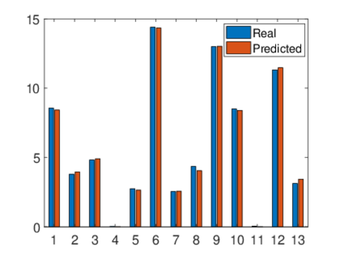

## Contents
* [Exercise 1](#exercise-1)
* [Exercise 2](#exercise-2)
* [Exercise 3](#exercise-3)
* [Exercise 4](#exercise-4)

## Exercise 1
```matlab
x = [0.52 8.0 17.95 28.65 50.65 104.6 156.6 260.7 364.4 468.0 507.0 520.0];
y = [5.28794 13.8400 20.2000 24.9000 31.1000 36.5000 36.6000 31.000 20.9000 7.8000 1.50000 0.200000];
% spline using csape
plot(x, y, 'o', 'MarkerSize', 8, 'linewidth', 1);
hold on;
pp = csape(x, y,[1 1],[1.86548 -0.046115]);
fnplt(pp);
set(gca, 'fontsize', 16);
hold off;
% get devirative
ppd1 = fnder(pp);
ppd2 = fnder(pp, 2);
nodepd1 = fnval(ppd1, x);
nodepd2 = fnval(ppd2, x);
% get integral
ppi = diff(fnval(fnint(pp),[0.52 520]));

nodepd1, nodepd2, ppi
```

**Results:**

First-order differential of each node:

 x | y'
:----------:|:----------:
0.52 | 1.8655    
8.0 | 0.7437
17.95 | 0.5329
28.65 | 0.3682
50.65 | 0.2088
104.6 | 0.0293
156.6 | -0.0212
260.7 | -0.0815
364.4 | -0.1064
468.0 | -0.1642
507.0 | -0.1353
520.0 | -0.0461

Second-order differential of each node:

 x | y''
:----------:|:----------:
0.52 | -0.2793
8.0 | -0.0206
17.95 | -0.0217
28.65 | -0.0091
50.65 | -0.0054
104.6 | -0.0012
156.6 | -0.0007
260.7 | -0.0004
364.4 | -0.0000
468.0 | -0.0011
507.0 | 0.0026
520.0 | 0.0112

```
Integral = 12905.
```

## Exercise 2
```matlab
xdata = [470 300 10; 285 80 10; 470 300 120; 470 80 120; 470 80 10; 100 190 10; 100 80 65; 470 190 65; 100 300 54; 100 300 120; 100 80 120; 285 300 10; 285 190 120];

rate = [8.5500; 3.7900; 4.8200; 0.0200; 2.7500; 14.3900; 2.5400; 4.3500; 13.0000; 8.5000; 0.0500; 11.3200; 3.1300];

options = optimset();
options.MaxFunEvals = 10000;
options.MaxIter = 10000;
options.TolX = 1e-10;

f = @(x, xdata) (x(1) * xdata(:, 2) + x(2) * xdata(:, 3)) ./ (1 + x(3) * xdata(:, 1) + x(4) * xdata(:, 2) + x(5) * xdata(:, 3));
[x, resnorm, residual, exitflag, output] = lsqcurvefit(f, [1 1 1 1 1], xdata, rate, [], [], options);
bar([rate, f(x, xdata)]);
legend(["Real"; "Predicted"]);
set(gca, 'fontsize', 16); 
```

**Results:**

$$
    \left\{
    \begin{aligned}
        & \beta_1 = 1.2526 \\
        & \beta_2 = -0.8394 \\
        & \beta_3 = 0.0628 \\
        & \beta_4 = 0.0400 \\
        & \beta_5 = 0.1124
    \end{aligned}
    \right.
$$

Prediction bar plot:



## Exercise 3
```matlab
v = [20 25 30 35 40 45 50 55 60 65 70 75 80];
d = [42 56 73.5 91.5 116 142.5 173 209.5 248 292.5 343 401 464];
pp = spline(v, d);
plot(v, d, 'x', 'MarkerSize', 8);
hold on;
fnplt(pp);
hold off;
xlabel('velocity(mile / h)');
ylabel('distance(ft)');
set(gca, 'fontsize', 16);
x = fsolve(@(x) fnval(pp, x) - 328, 65);
```

**Results:**

```
The maximum velocity = 68.5860 mph.
```

## Exercise 4
```matlab
DME = [0 10.0000 0.2000;
200.0000 300.0000 0.5000;
-300.0000 500.0000 0.2000;
-400.0000 -200.0000 1.0000;
200.0000 -200.0000 -1.0000];
d = [94.2340; 339.4322; 482.0996; 441.8201; 383.7252];
r = [2; 1; 1.5; 3; 0.5];
DME(:,4) = r;
dr = d ./ r;
x0 = [1; 1; 1];
x = lsqcurvefit(@curvefun1, x0, DME, dr);

plot3(DME(1, 1), DME(1, 2), DME(1, 3), 'bo', 'MarkerSize', 2*5);
hold on;
plot3(DME(2, 1), DME(2, 2), DME(2, 3), 'bo', 'MarkerSize', 1*5);
hold on;
plot3(DME(3, 1), DME(3, 2), DME(3, 3), 'bo', 'MarkerSize', 1.5*5);
hold on;
plot3(DME(4, 1), DME(4, 2), DME(4, 3), 'bo', 'MarkerSize', 3*5);
hold on;
plot3(DME(5, 1), DME(5, 2), DME(5, 3), 'bo', 'MarkerSize', 0.5*5);
hold on;
plot3(x(1), x(2), x(3), 'ro', 'MarkerSize', 20);
hold on;
line([DME(1, 1) x(1)], [DME(1, 2) x(2)], [DME(1, 3) x(3)]);
hold on;
line([DME(2, 1) x(1)], [DME(2, 2) x(2)], [DME(2, 3) x(3)]);
hold on;
line([DME(3, 1) x(1)], [DME(3, 2) x(2)], [DME(3, 3) x(3)]);
hold on;
line([DME(4, 1) x(1)], [DME(4, 2) x(2)], [DME(4, 3) x(3)]);
hold on;
line([DME(5, 1) x(1)], [DME(5, 2) x(2)], [DME(5, 3) x(3)]);
hold off;
xlabel('x-axis');
ylabel('y-axis');
zlabel('z-axis');
set(gca, 'fontsize', 16);

function f=curvefun1(b, x)
    f = sqrt((b(1) - x(:, 1)).^2 + (b(2) - x(:,2)).^2 + (b(3) - x(:,3)).^2) ./ x(:,4);
end
```

**Results:**

```
The coordinate is (-60.0000, 82.0000, 10.0001).
```