## Contents
* [Exercise 1](#exercise-1)
* [Exercise 2](#exercise-2)
* [Exercise 3](#exercise-3)
* [Exercise 4](#exercise-4)

## Exercise 1
```matlab
series1 = iterate(0.3, log10(3), 1000000);
figure(1)
plot(series1);
histogram(series1, 1000)

series2 = iterate(0.3, pi, 1000000);
figure(2)
plot(series2);
histogram(series2, 1000)

series3 = iterate(0.3, sqrt(5), 1000000);
figure(3)
plot(series3);
histogram(series3, 1000)

series4 = iterate(0.3, exp(1), 1000000);
figure(4)
plot(series4);
histogram(series4, 1000)

function series = iterate(x0, p, iteration)
    series(1) = x0;
    for i = 1: iteration
        series(i + 1) = series(i) + p - floor(series(i) + p);
    end
end
```

**Results:**


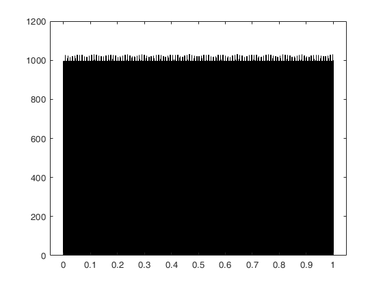
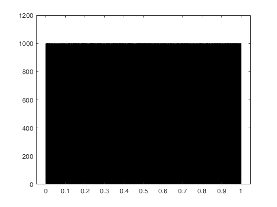


## Exercise 2
```matlab
a = 2.24;
b = 0.43;
c = -0.65;
d = -2.43;
e = 1.0;
iteration = 1000000;
[x, y, z] = clifford(a, b, c, d, e, iteration);
figure(1)
plot(x);
hold on;
plot(y);
plot(z);
hold off;
figure(2)
histogram(x, 1000)
figure(3)
histogram(y, 1000)
figure(4)
histogram(z, 1000)
figure(5)
plot3(x, y, z)

function [x, y, z] = clifford(a, b, c, d, e, iteration)
    x(1) = 0; 
    y(1) = 0; 
    z(1) = 0;
    for i = 1: iteration
        x(i + 1) = sin(a * y(i)) - z(i) * cos(b * x(i));
        y(i + 1) = z(i) * sin(c * x(i)) - cos(d * y(i));
        z(i + 1) = e * sin(b * x(i));
    end
end
```

**Results:**

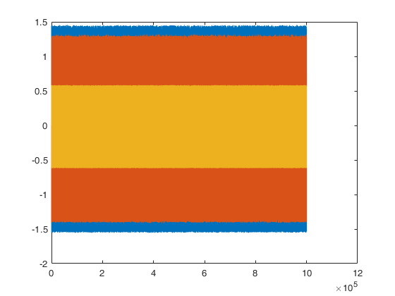
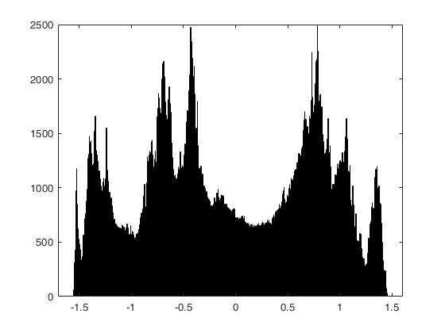
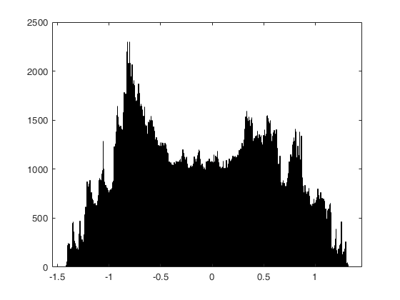
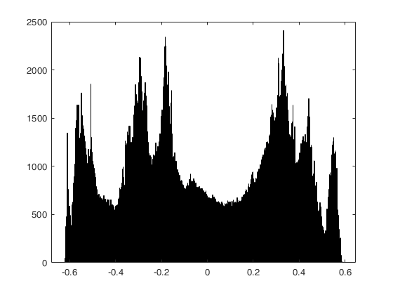
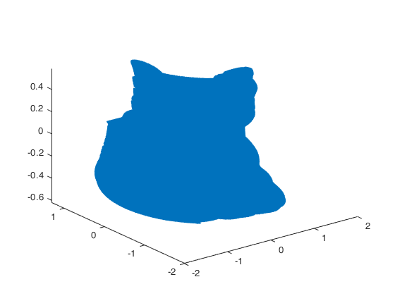

## Exercise 3
```matlab
recursion(12, [0, 0], pi / 2, 1)

function [x, y] = draw_line(orig, angle, length)
    x = orig(1) + length * cos(angle);
    y = orig(2) + length * sin(angle);
    plot([orig(1), x], [orig(2), y])
    axis([-1, 1, 0, 2])
    hold on
    drawnow;
end

function recursion(iter, orig, angle, length)
    if (iter == 1)
        draw_line(orig, angle, length);
    else
        [x, y] = draw_line(orig, angle, length);
        recursion(iter - 1, [x, y], angle - pi / 6, length / 2);
        recursion(iter - 1, [x, y], angle + pi / 6, length / 2);
    end
end
```

**Results:**

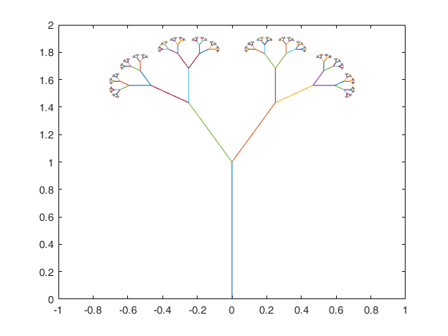

## Exercise 4
```matlab
eta = @(x) x >= 0 && x < 1;

alpha = pi / 3; % this value can change
beta = pi / 6; % this value can change
h0 = ((1 + cos(alpha) + sin(alpha)) * (1 - cos(beta) - sin(beta)) + 2 * sin(beta) * cos(alpha)) / 4;
h1 = ((1 - cos(alpha) + sin(alpha)) * (1 + cos(beta) - sin(beta)) - 2 * sin(beta) * cos(alpha)) / 4;
h2 = (1 + cos(alpha - beta) + sin(alpha - beta)) / 2;
h3 = (1 + cos(alpha - beta) - sin(alpha - beta)) / 2;
h4 = 1 - h0 - h2;
h5 = 1 - h1 - h3;

for i = 1: 5
    eta = @(x) h0 * eta(2 * x) + h1 * eta(2 * x - 1) + h2 * eta(2 * x - 2) + h3 * eta(2 * x - 3) + h4 * eta(2 * x - 4) + h5 * eta(2 * x - 5);
end

fplot(eta, [-2 * pi, 2 * pi])
```

**Results:**

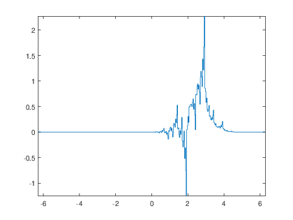
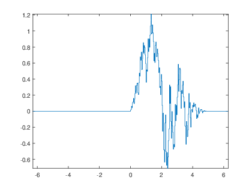
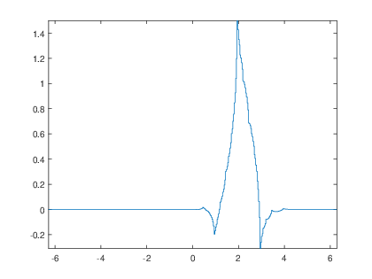