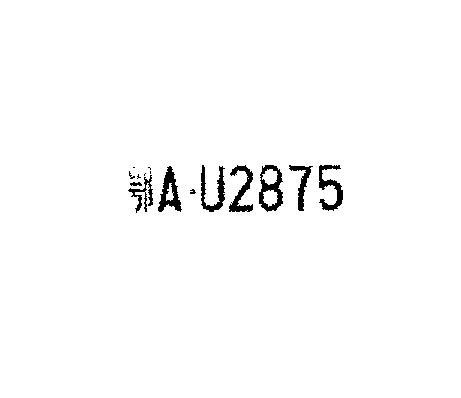

## Contents
* [Exercise 1](#exercise-1)
* [Exercise 2](#exercise-2)

**Please note that all the pictures used in this experiment are ONLY FOR ACADEMIC USE.**

## Exercise 1
```matlab
needed = imread('src.png');
needed = rgb2gray(needed);
water = imread('tgt.png');
water = rgb2gray(water);
alpha = 0.00000001;
[output, U1, V1, S] = waterprint(double(needed(541: 548, 425: 703)), double(water), alpha);
needed(541: 548, 425: 703) = uint8(output);

figure(1)
imshow(needed)
decode = de_waterprint(output, U1, V1, S, alpha);
figure(2)
imshow(uint8(decode))

function [output, U1, V1, S] = waterprint(src, tgt, alpha)
    [U, S, V] = svd(src);
    S0 = S + alpha * tgt;
    [U1, S1, V1] = svd(S0);
    output = U * S1 * V';
end

function output = de_waterprint(src, U1, V1, S, alpha)
    [~, S1, ~] = svd(src);
    S0 = U1 * S1 * V1';
    output = (S0 - S) ./ alpha;
end
```

**Results:**


## Exercise 2
```matlab
car = imread('carpack.png');
gray = rgb2gray(car);
figure(1);
imshow(gray);
thres = imbinarize(gray, graythresh(gray));
figure(2);
imshow(thres);
edging = edge(thres, 'sobel');
figure(3);
imshow(edging);
% finding minimum bounding rectangle
box = find(edging == 1);
left = int16(box(1) / size(edging, 1));
udrange = mod(box - 1, size(edging, 1)) + 1;
up = min(udrange);
target1 = find(edging(:, left) == 1, 1);
target2 = find(edging(up, :) == 1, 1);
target_angle = double(target1 - left + 10) / double(target2 - up - 10);
angle = atan(target_angle);
rotation = imrotate(thres, -rad2deg(angle), 'bilinear');
figure(4);
imshow(rotation);
init = find(rotation(ceil(size(rotation, 1) / 2), :), 1);
flood = floodfill(rotation, [ceil(size(rotation, 1) / 2), init]);
negate = imcomplement(flood);
figure(5);
imshow(negate);
flood_2 = floodfill(negate, [1 1]);
final = imcomplement(flood_2);
figure(6)
imshow(final)

function output = floodfill(im, initial)
    if (im(initial(1), initial(2)) == 0)
        output = im;
    else
        list = {initial};
        im(initial(1), initial(2)) = 0;
        while ~isempty(list)
            val = list{1};
            if (val(1) > 1)
                left = [val(1) - 1, val(2)];
            else
                left = [1, val(2)];
            end
            if (val(1) < size(im, 1))
                right = [val(1) + 1, val(2)];
            else
                right = [size(im, 1), val(2)];
            end
            if (val(2) > 1) 
                up = [val(1), val(2) - 1];
            else
                up = [val(1), 1];
            end
            if (val(2) < size(im, 2))
                down = [val(1), val(2) + 1];
            else
                down = [val(1), size(im, 2)];
            end
            if (im(left(1), left(2)) == 1)
                im(left(1), left(2)) = 0;
                list = [list, left]; 
            end
            if (im(right(1), right(2)) == 1)
                im(right(1), right(2)) = 0;
                list = [list, right]; 
            end 
            if (im(up(1), up(2)) == 1)
                im(up(1), up(2)) = 0;
                list = [list, up]; 
            end
            if (im(down(1), down(2)) == 1)
                im(down(1), down(2)) = 0;
                list = [list, down];  %#ok<*AGROW>
            end
            list(1) = [];
        end
        output = im;
    end
end
```

**Results:**


